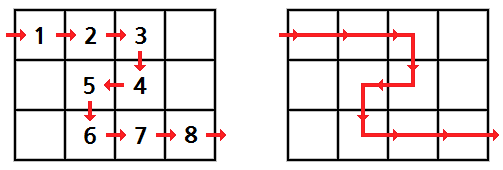
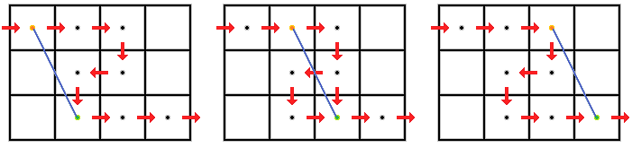
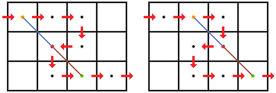

# 놀이 공원

문제 ID: `AMUSEMENTPARK`

## 문제

#### 문제

21xx년, 오렌지는 우주 최고의 놀이 공원인 네버랜드에 놀러 왔다! 네버랜드에서 가장 유명한 놀이 기구는 약 11km의 길이를 약 1분만에 주파하는 롤러 코스터 A-Express! 이 놀이기구를 타지 않으면 죽을 것 같다는 기분이 든 오렌지는 네버랜드에 도착하자 마자 바로 A-Express를 향해 달렸다! 그러나 A-Express는 매우 유명한 놀이 기구라 오렌지가 입구에 도착 했을 때 이미 줄이 가득 차 있어 줄에 들어가기 위한 줄을 서서 기다려야 했다. 이 기다리는 시간을 이용해 네버랜드가 줄을 어떻게 관리하는지 알아보자.

네버랜드는 줄을 선 사람들의 관리를 위해 줄을 특정 크기의 정사각형 격자로 나누어, 한 칸에 한 사람만 들어가 있도록 줄을 세운다. A-Express의 줄을 이루는 격자의 변은 남북 방향, 동서 방향에 평행하다. 이 격자에서 남북방향으로 있는 칸의 개수는 $N$개, 동서 방향으로 있는 칸의 개수는 $M$개로 $N \times M$크기의 격자를 이루며, 이 중에서 몇 개의 칸이 줄로 사용되고 있다. 앞으로 북쪽에서 $i$번째, 서쪽에서 $j$번째에 있는 격자를 $(i, j)$로 표현하도록 하자. 이 때, 줄의 입구는 $(1, 1)$의 왼쪽 변이고 A-Express를 타는 곳은 $(N, M)$의 오른쪽 변이다.

다음은 $N = 3$, $M = 4$인 예이다. $N \times M$크기의 격자에서 줄로 사용되는 칸에는 양의 정수가 적혀 있고, 수가 적힌 순서대로 이동하면 줄이 된다. 양의 정수가 적히지 않은 칸은 표지판이나 쓰레기통 등으로 사용되는 칸으로 사람이 서는 줄로는 사용되지 않는 칸이다. 결국 사람들이 기다리는 줄은 인접한 칸이면서, 각 칸에 적힌 정수의 차이가 정확히 $1$이 나는 것들의 정중앙을 연결하는 선분들로 표현할 수 있다. 그림 1은 이런 식으로 그려진 줄을 나타낸다.

  
그림 1

드디어 오렌지가 A-Express의 줄에 들어갈 차례가 되어 A-Express의 줄에서 $1$이 써진 칸($(1, 1)$)에서 줄서기를 시작했다. 그 순간 오렌지에게 놀라운 메시지가 왔는데, 평소에 잘 알고 지내던 멜론도 이 줄에 서있어서 오렌지가 들어오는 것을 보았다는 것이다. 또한, 현재 $S$가 적힌 칸에 멜론이 있다는 사실도 알려주었기 때문에 오렌지도 멜론을 찾아보기로 했다.

줄에 서 있는 사람들의 이동은 다음과 같다. 먼저, 오렌지가 $1$이 써진 칸에 있을 때, 줄에 속한 다른 모든 칸에는 사람이 한 명씩 있다. A-Express는 최고의 경험을 위해 한 번의 운행에 한 사람만을 태우는 롤러코스터이기 때문에, 한번에 줄의 가장 앞에 있는 한 사람만 빠진다. 위의 예에서는 $8$이 써진 칸($(3, 4) = (N, M)$)에 있는 사람이 A-Express에 탑승하기 위해 줄에서 빠지는 것이다. 이 사람이 빠지는 동시에, 순간 이동 기술을 이용해 사람들은 직접 몸을 움직일 필요 없이 다음 칸으로 자동적으로 이동한다. 그리고 인기가 많은 A-Express의 특성상 동시에 $1$이 써진 칸에 다른 사람이 순간 이동해 들어온다.

그림 2와 그림 3은 각각 $S = 6$, $S = 7$일 때에 대한 사람들의 이동을 그린 그림이다. 격자는 사람에 비해 매우 크기 때문에, 앞으로는 모든 사람을 점과 같은 크기를 가지는 것으로 생각한다. 주황색 점은 오렌지, 초록색 점은 멜론, 검은색 점은 다른 사람들이다. 파란색 선은 오렌지가 멜론을 바라보는 시야를 나타낸다. 오렌지가 바라보는 방향에 다른 사람이 있으면, 그림 3처럼 오렌지는 멜론을 못 볼 수 있다. 오렌지의 시야를 가리는 사람은 붉은색 점으로 표시하고, 이후의 보이지 않는 시야를 갈색 선으로 표시하였다.

  
그림 2. $S = 6$, 오렌지는 총 3번 멜론을 볼 수 있다.

  
그림 3. $S = 7$, 오렌지는 한 번도 멜론을 볼 수 없다.

줄을 서는 모든 사람이 칸의 정중앙에서 벗어나지 않으며, 빈 칸은 시야를 막지 않는다고 가정한다. 이 때 오렌지가 줄에 들어온 시점부터 멜론이 A-Express에 탑승하기 직전까지 오렌지에게서 멜론이 보이는 횟수를 구하고, 그 때 오렌지가 있었던 위치에 어떤 정수가 적혀 있는지 출력하는 프로그램을 작성하라. 그림 2의 경우에는 $1$, $2$, $3$이 적힌 칸으로 세 개, 그림 3의 경우에는 어떤 칸도 없는 것이 답이다.

## 입력

#### 입력

첫 번째 줄에 세 정수 $N$, $M$, $S$가 공백 하나로 구분되어 주어진다. ($1 \le N$, $M \le 20$) $N$, $M$은 A-Express의 줄을 포함하는 격자의 크기를 나타내며, $S$는 오렌지가 $1$이 써진 칸에 들어 왔을 때, 멜론이 있는 칸에 써진 수를 나타낸다.

두 번째 줄부터 $N$개의 줄에 걸쳐 각 줄에 격자의 정보인 $M$개의 음이 아닌 정수가 공백 하나로 구분되어 주어진다. 이 때, $i$번째 줄의 $j$번째 수는 격자의 칸 $(i, j)$에 써진 양의 정수인 $P\_{i, j}$를 나타낸다. 만약 $P\_{i, j} = 0$이면, $(i, j)$는 줄에 포함되지 않는 칸으로 생각한다. $P\_{1, 1} = 1$이고, $2 \le S \le P\_{N, M}$를 만족한다. $P$는 문제에서 주어진 A-Express의 줄을 올바르게 나타낼 수 있도록 주어진다.

## 출력

#### 출력

첫 번째 줄에 오렌지가 멜론을 볼 수 있는 횟수를 출력한다. 이 횟수를 $C$라고 하면, 다음 $C$개의 줄에는 오렌지가 어떤 칸에 있을 때 멜론이 보이는지 그 칸에 적힌 정수를 각각 오름차순으로 출력한다.

## 노트

#### 노트

예제 입출력에서 Example로 시작하는 줄은 실제 입출력에 포함되지 않습니다. 각각을 하나의 입출력 세트로 읽어주세요.
