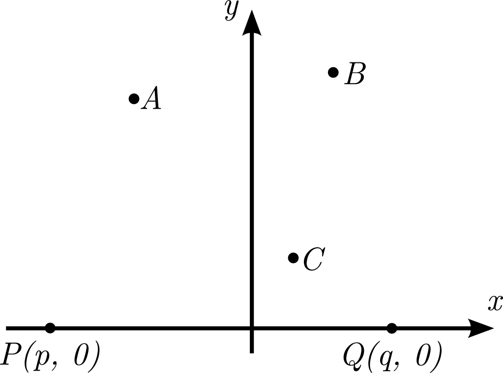

# Annie and Tibber

문제 ID: `ANNIETIBBER`

## 문제

#### 문제

애니와 티버는 x축 위에서 여행을 하고 있었다. 애니의 위치는 P(p, 0)이고, 티버의 위치는 Q(q, 0)이다. 어느 날 문득 하늘을 바라본 애니와 티버는 서로 이야기를 하던 도중 별들 사이의 좌우관계에 흥미를 가지게 되었다.

> *애니*: A별이 B별보다 왼쪽에 있네!  
> *티버*: 응!  
> *애니*: 그리고 B별은 C별보다 왼쪽에 있네!  
> *티버*: B가 C보다 오른쪽에 있는것 같은데?  
> *애니*: 그래? 내가 봤을때는 왼쪽에 있는데?!

여기서 점 X에서 보았을 때 A별이 B별보다 왼쪽에 있다는 것은, X->B->A 가 왼쪽으로 꺾였다는 것을 의미한다. 애니는 하늘에 있는 모든 별들의 쌍 중에서 티버가 보았을 때와 좌우관계가 반대인 쌍이 몇 개나 되는지 알고 싶어졌다. (A, B) 쌍은 (B, A) 쌍과 같은 것으로 보아 한 번씩만 센다. 모든 별들은 애니가 보았을때도 직선상에 둘 이상 있지 않고, 티버가 보았을때도 직선상에 둘 이상 있지 않다.

## 입력

#### 입력

첫 줄에 테스트 케이스의 수 T가 주어진다.  
각 테스트 케이스마다 첫 번째 줄에 애니와 티버가 관찰한 별의 수 N(1 <= N <= 100,000)과 애니의 위치와 티버의 위치를 표현하는 두 정수 p, q 가 주어진다.

그 다음 줄부터 N줄에 걸쳐 애니와 티버가 관찰한 별의 좌표를 표현하는 두 정수 xi, yi 가 주어진다. 애니, 티버의 위치와 모든 별의 x 좌표는 -106 이상 106 이하의 정수이다. 모든 별의 y 좌표는 1 이상 106 이하의 정수이다.

## 출력

#### 출력

각 테스트 케이스에 대해서 애니와 티버가 보았을 때 서로 좌우관계가 반대인 쌍의 수를 출력한다.

## 노트

#### 노트
