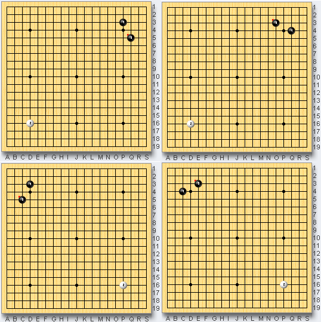
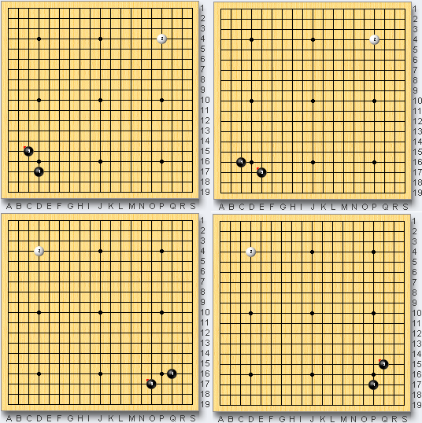

# 바둑

문제 ID: `BADUK`

## 문제

#### 문제

바둑이란 두 사람이 흑, 백의 바둑돌을 규칙에 따라 바둑판에 교대로 돌을 놓으며 진행하는 두뇌게임이다.  
바둑판에는 가로 19줄, 세로 19줄의 선이 그어져 있고, 교차점에 돌을 놓는다.  
처음에 흑이 먼저 두고, 그 다음에 백이 둔다. 이렇게 한번씩 두는 돌 하나하나를 '수'라고 부른다.

바둑은 보통 250 ~ 300 수 사이에서 끝나는데,  
첫 수부터 30수에서 50수 정도까지를 '포석'이라고 한다.

포석에서 돌이 놓인 배치가 같으면 '같은 포석'이라고 한다.

하나의 포석이 놓인 바둑판은 상하좌우 어느 방향에서 봐도 같은 포석이고,  
모든 돌의 배치를 좌우나 상하로 뒤집어도 역시 같은 포석이다.

그러므로 아래 8개의 포석은 모두 같은 포석이다.

  

바둑판의 가로선과 세로선의 개수가 둘다 n개인 바둑판이 있고,  
흑, 백, 흑이 교대로 한 수씩 놓아 3수까지 진행되었을 때, 나올 수 있는 모든 포석의 개수를 구하라.  
위 그림은 n = 19 인 경우다.  
물론 같은 포석은 한번만 센다.

힌트 : 답은 1018 보다 작다.

## 입력

#### 입력

첫째 줄에는 테스트 케이스의 개수 T가 주어진다. ( T <= 100 )  
  
그 다음 T줄에 걸쳐, 정수 n이 주어진다. ( 2 <= n <= 1500 )

## 출력

#### 출력

각각 테스트 케이스에 대해, 나올 수 있는 모든 포석의 개수를 출력한다.

## 노트

#### 노트
