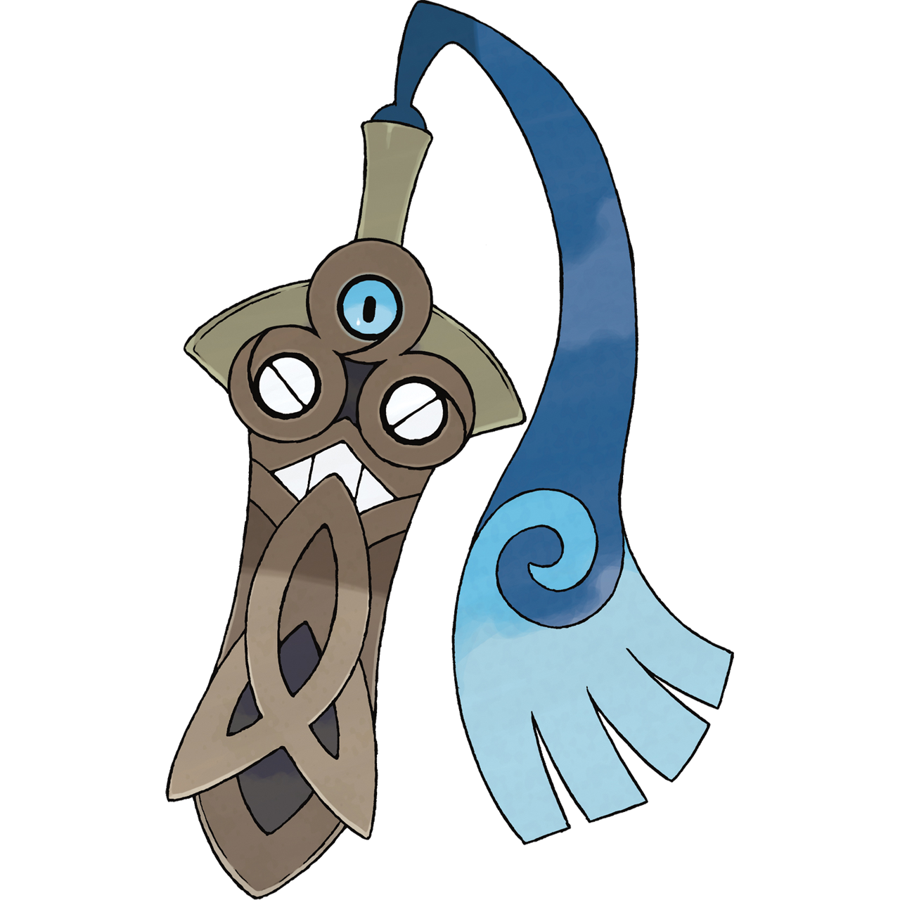
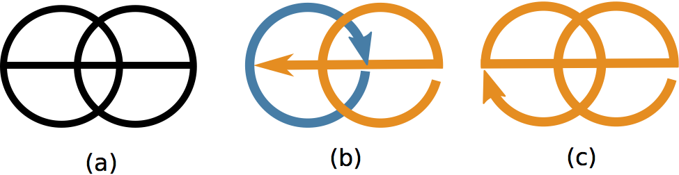
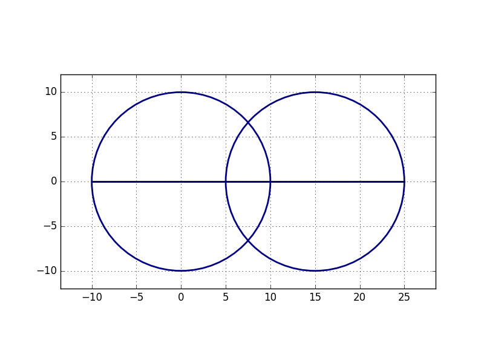
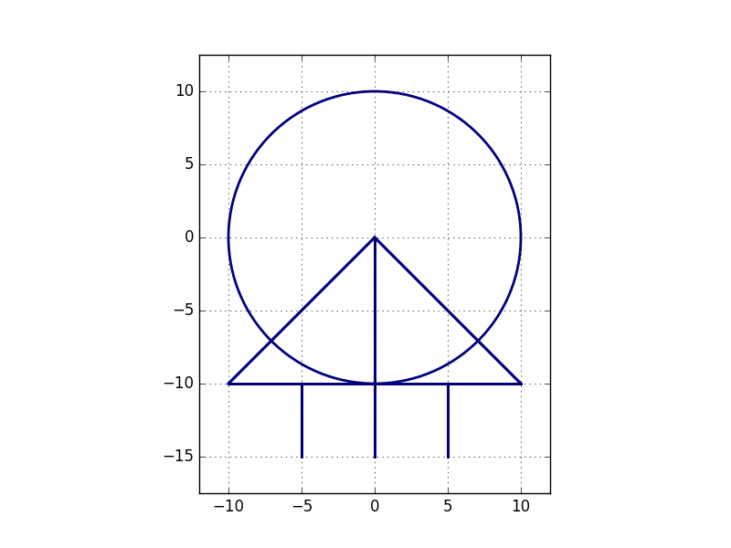

# 단칼빙

문제 ID: `BEING`

## 문제

#### 문제

단칼빙은 무엇이든 싹둑싹둑 잘라 버리는 훌륭한 포켓몬이다. 단칼빙은 그 이름답게 대부분의 것들을 한 번에 잘라 버릴 수 있지만, 가끔 한 번에 자를 수 없는 것을 만나면 혼란에 빠지게 된다. 오늘 단칼빙에게는 선분과 원들이 그려진 종이가 주어졌다. 이 선분과 원들의 합집합으로 구성된 도형을 따라 종이를 잘라야 하는데, 한 선분이나 곡선은 정확히 한 번만 자르고 지나갈 수 있다. 따라서 중간에 칼을 종이에서 떼고 다른 점에서 자르기 시작해야 할 수도 있다. 물론 단칼빙은 칼질 횟수를 최소한으로 하고 싶어한다.

주어진 도형을 정확히 한 번씩 자르기 위해 칼을 종이에 최소 몇 번이나 대야 하는지를 계산하는 프로그램을 작성하라. 예를 들어 아래 그림 (a)에 주어진 종이는 (b)처럼 자르면 칼질을 두 번 해야 하지만, (c)처럼 자르면 칼질 한 번만에 자를 수 있다.

## 입력

#### 입력

입력의 첫 번째 줄에 테스트 케이스의 개수 $C$($1 \le C \le 100$)가 주어진다.

각 테스트 케이스의 첫 번째 줄에는 종이 위에 그려진 도형의 개수 $N$($1 \le N \le 100$)이 주어진다. 각 테스트 케이스의 두 번째 줄부터 $N$개의 줄에 걸쳐 각 줄에 하나씩 도형의 정보가 주어진다. 도형의 정보는 해당 도형이 $(x\_1, y\_1)$에서 $(x\_2, y\_2)$로 가는 선분일 경우 해당 줄은 "segment $x\_1$ $y\_1$ $x\_2$ $y\_2$"로 표현되며, $(x, y)$를 중심으로 하고 반지름 $r$인 원일 경우 "circle $x$ $y$ $r$"로 표현된다. 이 때, 각 선분의 두 끝 점은 같지 않다.

주어지는 모든 좌표는 $[-1000, 1000]$ 범위 내의 정수이고, 반지름은 $(0, 1000]$ 범위의 정수이다.

## 출력

#### 출력

각 테스트 케이스마다 첫 번째 줄에 해당 선분들을 모두 자르기 위해 필요한 칼질의 최소 횟수를 출력한다.

## 노트

#### 노트

예제 입력의 테스트 케이스에서 주어지는 도형들을 그리면 아래 그림을 각각 얻을 수 있다.

