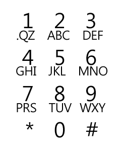

# Broken Keypad

문제 ID: `BROKENKEY`

## 문제

#### 문제

You dropped your cellular phone and all keys are broken. You need to fix them to be able to use your phone for text-messaging, but you don't have enough money to fix them all. So you decided to fix some of the broken keys, which are frequently used for writing a text message.

Your first objective is to maximize the number of messages you can send, after fixing some of the keys. In case of a tie, you would like to minimize the number of keys you need to fix, in order to fix those messages. Write a program that computes these two numbers: the maximum number of messages you can send (after fixing some of the keys) and the minimum number of keys that need to be fixed in order to send that number of messages.

## 입력

#### 입력

The first line of input contains the number of test cases T.  
For each test case, the first line contains two integer N (1 < N <= 20), M (1 <= M <= N). N represents the number of keys in your phone and M is the maximum number of keys you can fix.

Each of the next N lines contain a string that consists of lowercase alphabets, a period, and a space such that each of the lowercase alphabets, a period and a space will appear exactly once in the concatenation of the N strings; hence, the sum of the lengths of the N strings will always be 28.

Next line contains an integer S (0 < S <= 500) that represents the number of messages that you want to type.

Each of the following S lines describes a message: the length of each message is between 1 and 100, inclusive. All messages consist of lowercase alphabets, period(s) and space(s) only.

## 출력

#### 출력

For each test case, your program should output two integers separated by a single space: the maximum number of messages that you can send (after fixing some of the keys) and the number of keys you wish to fix.

## 노트

#### 노트
