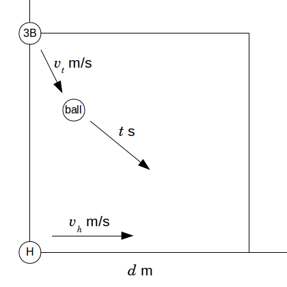

# 번트의 장인

문제 ID: `BUNT`

## 문제

#### 문제

콩대 야구부의 조인성 타자는 번트의 장인이다. 그는 투수가 어떤 공을 던지든 일정한 범위 내에서 자신이 원하는 위치로 공을 정확하게 보낼 수 있는 능력을 가지고 있다. 공을 보낸 위치가 수비수와 너무 가까울 경우, 수비수가 공이 있는 위치로 뛰어간 뒤 공을 1루에 던지기까지 걸리는 시간이 타자가 1루까지 뛰는 시간보다 가까워 아웃될 수 있다. 따라서 타자는 수비수의 수비 시간보다 빠르게 1루에 도착할 수 있는 위치로 공을 보내야 한다.

문제를 간단히 하기 위해 다음과 같은 가정을 하자. 야구장은 각도가 $90 ^{\circ}$인 부채꼴 모양이며, 내야는 한 변의 길이가 $d$미터인 정사각형이다. 내야의 꼭지점은 반시계 순서로 홈, 1루, 2루, 3루이다. 타구를 잡아 1루로 던지는 수비수는 3루수가 유일하며, 공이 배트에 닿는 순간 3루(정사각형의 꼭지점)에서 출발한다. 타자는 홈(정사각형의 꼭지점)에서 $r$미터 반경 이내의 야구장 공간 중 임의의 위치로 공을 보낼 수 있으며, 공은 배트에 닿자 마자 타자가 원하는 위치로 순간이동한다.  
배트에 맞은 공은 상당히 빠르게 움직이기 때문에 문제를 간단히 하기 위하여 순간이동으로 취급한다.  
3루수는 $v\_t$ m/s의 일정한 속도로 공의 위치로 직선으로 달려가며, 공을 잡자마자 1루에 정확하게 던지고 그 공은 $t$초 후에 도착한다. 타자는 공이 배트에 닿자마자 $v\_h$ m/s의 일정한 속도로 1루로 달려간다. 공이 1루에 도착하는 시간이 타자가 1루에 도착하는 시간보다 빠르면 타자는 아웃, 그렇지 않으면 세이프다. 이를 그림으로 나타내면 아래와 같다.

조인성 타자는 자신이 출루에 성공하기 위해 얼마나 많은 곳으로 공을 보낼 수 있는지 알고 싶어한다. 내야의 크기 $d$, 타자가 공을 보낼 수 있는 반경 $r$, 3루수의 이동 속도 $v\_t$, 송구 시간 $t$, 타자의 이동 속도 $v\_h$가 주어졌을 때, 타자가 공을 보내면 출루에 성공하는 영역의 넓이를 구하는 프로그램을 작성하시오. 절대/상대 오차 $10^{-8}$ 이하는 정답으로 인정한다.

## 입력

#### 입력

첫 줄에 테스트 케이스의 수 $T$ ($T \le 1000$)가 주어진다. 두 번째 줄부터 $T$줄에 걸쳐 각각의 테스트 케이스가 입력된다.  
각 테스트 케이스는 음이 아닌 10000 이하의 다섯 개의 실수로 입력되며, 각각 $d$, $r$, $v\_t$, $t$, $v\_h$이다. 문제의 상황이 성립할 수 없는 입력은 주어지지 않는다.

## 출력

#### 출력

각 테스트 케이스에 대해, 공을 보내면 출루에 성공하는 영역의 넓이를 출력한다.

## 노트

#### 노트
