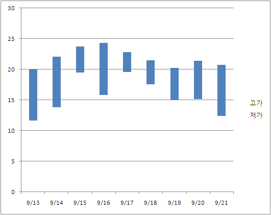

# Candlestick Charts

문제 ID: `CANDLESTICK`

## 문제

#### 문제

A candlestick chart, often abbreviated to candle chart, is a variation of a bar chart. It is mostly used to describe the price of a stock over time.

You are using a simple candle chart which looks like above. Each bar in the graph shows the range of prices at which the stock has been traded in a day. The top of the bar denotes the highest price, and the bottom denotes the lowest price.

Looking at this chart, you want to find out the true price of the stock. You think the price will move around the true price, above and below. Your strategy is simple: buy the stock below this price, and sell it above this price, so you will always make money.

In your model, the true price fluctuates within a certain interval. This interval should have the following properties:

1. Since smaller intervals are unlikely to be true, larger intervals are better than smaller intervals.
2. In most of the days, the range(interval) [lowest traded price, highest traded price] will contain this interval.

According to this, you make a selection criteria. Let’s say that an interval [low, high] satisfies a day if the interval is completely contained within the traded price range. For example, [10, 18] satisfies [8, 20] but not [11, 30]. If then, the score for this interval is: (Maximal number of consecutive days that this interval satisfies) × (high − low). For example, suppose a stock was traded for three days, where on each day the price ranged in [10,18], [9,16], and [12,19]. An interval [10, 16] will satisfy the first two days, so  
it has a score of 2×6 = 12. [16, 18] satisfies at most one consecutive day(first or third day), so the score is 1 × 2 = 2.

Given a candle chart, write a program to find the highest scoring interval.

## 입력

#### 입력

The first line of the input has the number of test cases T(1 <= T <= 50). T test cases follow.  
In each test case, the first line contain the number of days in the chart N(1 <= N <= 2, 000). In the following N lines, the traded price range of each day will be given – low and high. All prices are positive integers less than 100,000.

## 출력

#### 출력

Print T lines, one line for each test case. In each line, print out the score of the highest-scoring interval.

## 노트

#### 노트
