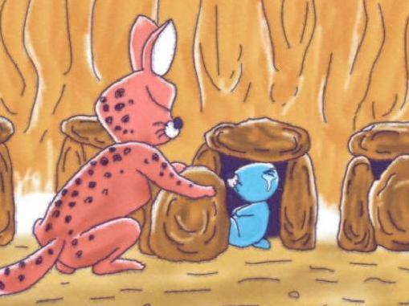

# 보노보노와 동굴 아저씨

문제 ID: `CAVEMAN`

## 문제

#### 문제

> 동굴 아저씨는 어디선가 나타난다.  
>   
> 동굴 아저씨는 존재한다.  
>   
> 곤란해하기만 하면 동굴 아저씨가 가둬버릴지도 몰라.  
>   
> 하지만 곤란한 건 어쩔 수 없는데.  
>   
> 동굴 아저씨가 나타나면 난 더 곤란한데.  
>   
> — 보노보노(해달, 불명)

아기 해달 보노보노는 동굴 아저씨를 한 번도 만나본 적이 없지만 무척이나 무서워한다.  
동굴 아저씨는 언제건 **“나쁜 아이는 동굴 안에 가둬버린다”**며 보노보노를 아래 그림과 같이 동굴 안에 가두어버리기 때문이다. 너부리에게 동굴 아저씨 따위는 없다고 핀잔을 듣곤 하지만, 그런 것 따위 아무래도 상관없다.

보노보노는 동굴 아저씨에게 갇히는 상상을 하다가 용기를 내어 인권· · · 아니 해달권을 주장하기로 했다. 아무리 잘못했기로서니 빛이 하나도 들어오지 않는 어두컴컴한 곳에 가두는 것은 너무나 잔혹한 일이다. 그래서, 보노보노는 동굴 안을 환하게 밝혀 달라고 동굴 아저씨에게 사정했다.

동굴 아저씨는 사실 그렇게 나쁜 사람· · · 아니 동물이 아니라서, 그 부탁을 들어주기로 했다. 동굴 아저씨의 동굴은 직선 형태로 뻗어 있고, 그 안에 보노보노와 다른 나쁜 아이들이 갇혀 있는 돌무더기 *N* 개가 일정한 간격으로 존재한다. 동굴 아저씨는 나쁜 아이들 중 몇몇에게 횃불을 맡길 생각이다. 횃불을 맡은 나쁜 아이는 어두컴컴한 곳에 갇혀 있는 대신 횃불을 들고 서있어야 한다.

그런데 횃불은 크고 무겁고, 동물들은 각자 체격 조건이 다르기 때문에 감당할 수 있는 횃불의 크기가 다를 수 있다. 횃불의 크기는 양의 정수로 정의되는데, 크기가 *k* 인 횃불은 자기 자신을 포함하여 좌우로 *k − 1* 개의 돌무더기를 더 밝힐 수 있다. 예를 들어 크기가 2인 횃불은 총 세 개의 돌무더기를 밝힐 수 있다.  
동굴 아저씨는 최대한 많은 나쁜 아이들에게 벌을 주어야 하기 때문에 되도록 적은 동물들에게 횃불을 들고 서 있게 하고 싶다. 동굴을 모두 밝히기 위해서는 최소 몇 마리의 동물이 횃불을 들고 서 있어야 하는가?

## 입력

#### 입력

입력은 여러 개의 테스트 케이스로 구성된다. 입력의 첫 행에는 테스트 케이스의 수 *T* 가 주어진다.

각 테스트 케이스의 첫 행에는 돌무더기의 갯수 *N* (1 ≤ *N* ≤ 200,000)이 주어진다. 다음 행에는 동굴의 맨 왼쪽의 돌무더기에 갇힌 동물부터 차례로 감당 가능한 횃불의 크기를 나타내는 정수 *N* 개가 주어진다. 횃불의 크기는 1 이상 200,000 이하이다.

## 출력

#### 출력

각 테스트 케이스에 대해 한 행에 하나씩, 횃불을 들어야 하는 최소 동물의 수를 출력한다.

## 노트

#### 노트
