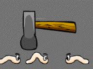

# Camel Cricket

문제 ID: `CCRICKET`

## 문제

#### 문제

  
  
룸메이트가 추석연휴를 맞아 집에 가 있는 동안 **LIBe**는 화장실에 침입한 **꼽등이(Camel Cricket!)**를 보고 흥분한 나머지 옆에 있던 망치로 꼽등이를 잡다가 화장실에 있는 타일을 많이 부수고 말았다.

당황한 **LIBe**는 집 근처에서 타일을 파는 **Kureyo Company**와 **Being Mart**를 방문했다.  
세계적인 타일 제조 회사로 유명한 두 회사에서는 각각 다른 크기의 타일을 만든다.  
**Kureyo Company**에서는 1x1 크기의 타일을, **Being Mart**에서는 1x2 크기의 타일을 만든다.  
두 회사의 타일 제조 과정이 달라서 비용에 차이가 있지만, 국제 타일 규격을 준수하기 때문에 어느 타일을 사용해도 크게 문제가 되지 않았다.

**LIBe**는 화장실에 타일이 깨진 모양을 살펴보고 최소한의 비용으로 복구하기 위해 프로그래밍을 시작했다.  
하지만 꼽등이를 본 충격으로 말미암아 손이 마음대로 움직이지 않아 여러분에게 도움을 청하고 말았다.   
부서진 타일들의 정보가 입력으로 주어질 때, 모든 타일을 교체하는 데 필요한 최소한의 비용을 구하시오.  
다만, 꼽등이를 잡는 데 사용했던 망치에는 연가시가 서식하고 있어 사용할 수 없으므로 부서지지 않은 타일은 더는 떼어낼 수 없다.

## 입력

#### 입력

입력의 첫 줄에는 테스트 케이스의 수 T 가 주어진다.

각 테스트 케이스의 첫 줄에는 화장실의 크기 N, M (1 <= N, M <= 100) 과 **Kureyo Company** 에서 판매하는 타일의 개당 가격인 P\_1, **Being Mart** 에서 판매하는 타일의 개당 가격인 P\_2 가 공백을 사이에 두고 주어진다 (1 <= P\_1, P\_2 <= 1000).  
그 다음 N 줄에 걸쳐 한 줄에 M 개씩의 숫자가 공백 없이 입력되며, 각 숫자는 해당 위치의 타일이 깨졌다면 0, 깨지지 않았다면 1이다.

## 출력

#### 출력

각 테스트 케이스에 대해 한 줄에 하나씩 화장실의 깨진 타일을 모두 복구하는 데 필요한 비용을 출력한다.

## 노트

#### 노트
