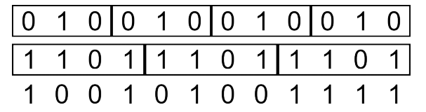

# 매미 원리

문제 ID: `CICADAPRINCIPLE`

## 문제

#### 문제

여름이면 성장을 마치고 지상으로 나와 구애를 하는 매미들의 경우, 대부분의 종은 매년 여름 지상에서 발견할수 있다. 이와는 달리 일부 종은 다른 해에는 발견되지 않다가 특정 해에만 대량 발견되곤 한다.

예를 들어 북미에는 이러한 매미가 일곱 종이 있으며, 이러한 매미들을 매미목 매미과의 주기매미속 (Magicicada)으로 분류한다. 이들 중 네 종은 주기가 13년이고, 세 종은 17년 간격으로 지상에 대규모로 등장한다.이들이 12년째, 16년째 등에 등장하는 경우는 거의 발견되지 않는다. 이와 같이 소수 간격의 동기화된 생애 주기를 설명할 수 있는 가장 설득력있는 가설은 천적의 개체 수 증감 사이클과의 생애 주기가 동기화되는 일을 최소화하고 지상으로 나갈 때에는 최대한 많은 개체가 나감으로써 생존을 보장하고자 한다는 것이다. 실제로,주된 천적인 새, 거미, 뱀의 경우 2–6년 간격으로 개체 수의 증감을 보인다고 한다.

이와 같은 효율적인 원리를 웹 디자인에 응용할 수 있다. 웹 페이지의 배경 이미지로 작은 소수 길이의 패턴 여러 가지를 포개어 놓으면 사람의 눈으로는 규칙성을 파악할 수 없다는 것이다. 예를 들어 29픽셀, 37픽셀, 53픽셀 간격으로 반복되는 세 패턴을 준비해 포개어 두게 되면 29 × 37 × 53 = 56869픽셀의 간격으로 같은 패턴이 반복되게 된다.

특급 긱인 Being은 이를 이용해 웹 페이지의 배경 이미지를 줄무늬로 디자인하려고 한다. 줄무늬이므로 이를 1차원의 색상 배열로 생각할 수 있다. 그러나 이 웹 페이지는 흑백 터미널 시절에 대한 오마쥬를 컨셉으로 하기 때문에, 사용할 수 있는 색은 검은 색과 흰 색 뿐이다.

Being은 시험 삼아 패턴 여러 개를 겹쳐 보았는데, 흰 색이 지나치게 많이 등장하는 문제가 있었다. 이를 해결하기 위해 최종적으로 표현되는 색을 해당 칸의 여러 색들 중 하나가 흰 색일 때 흰 색으로 두는 것이 아니라, 검은 색과 흰 색을 각각 0과 1로 표현하여 XOR 연산을 한 결과값으로 생각하기로 하였다. 이와 같이 하니 무늬가 마치 난수열과도 같이 적절하게 표시되는 것을 확인할 수 있었다.

이렇게 하고 나니 자연스럽게 이 결과물이 얼마나 규칙성을 파악하기 어려운 지 알아내고 싶어진 Being은 이문제를 해결하는 프로그램을 작성하기로 했다. 패턴의 개수 N 과 각 패턴의 길이 Li, 그리고 이 패턴들의 시작점을 일치시켜 여럿 겹쳤을 때의 결과의 맨 앞 일부분이 주어졌을 때 가능한 패턴들의 방법의 수를 결정하는 프로그램을 작성하자.

## 입력

#### 입력

입력은 여러 개의 테스트 케이스로 구성된다. 입력의 첫 행에는 테스트 케이스의 수 T 가 주어진다.

각 테스트 케이스의 첫 행에는 패턴의 개수 N(1 ≤ N ≤ 100)과 각 패턴의 길이를 나타내는 N 개의 정수 Li(1 ≤ Li ≤ 100)가 공백으로 구분되어 주어진다. 패턴의 길이의 총 합은 63을 넘지 않는다. 다음 행에는 패턴을 표시한 결과의 맨 앞 일부분을 나타내는 "0"과 "1"로 구성된 문자열 S(1 ≤ |S| ≤ 10000)가 주어진다.

## 출력

#### 출력

각 테스트 케이스에 대해 한 행에 하나씩, 가능한 패턴의 수를 출력한다.

## 노트

#### 노트

첫 번째 테스트 케이스의 경우 "010"과 "1101", 또는 "101"과 "0010" 두 가지 조합이 가능하다.  
이 문제는 아래의 웹 페이지를 참조했다.

1. [Periodical Cicada Page](http://insects.ummz.lsa.umich.edu/fauna/michigan_cicadas/Periodical/)
2. [The Cicada Principle and Why It Matters to Web Designers](http://designfestival.com/the-cicada-principle-and-why-it-matters-to-web-designers/)
