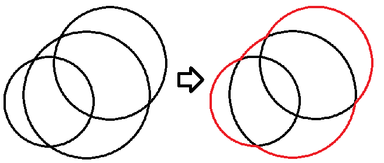

# Union of Circles

문제 ID: `CIRCLES`

## 문제

#### 문제

$N$개의 원들의 영역의 합집합의 넓이를 구하는 법에 대해 생각해봅시다.

그린 정리에 의해 임의의 폐곡선 $C$의 넓이를 구하는 식은 다음과 같습니다.

$$\frac{1}{2} \oint\_C \! x \, \mathrm{d}y - y \, \mathrm{d}x$$

원들이 다음과 같이 주어져 있다고 합시다. 이 원들을 폐곡선으로 나타내는 것은 가장 외곽에 있는(호가 다른 원에 포함되지 않는 부분)부분이 원의 중심을 기준으로 어느 각도의 구간에 포함되는지 검사하면 됩니다.

이제 각 원을 원의 중심$(x\_c,y\_c)$를 기준으로 한 각도를 매개변수로 하여 식을 만들면

$$\begin{cases} x=x\_c+r\_c \cos \theta \\ y=y\_c+r\_c \sin \theta \end{cases}$$

가 되고, 또한 각 원에 대해 외곽선에 원의 중심을 기준으로 각도가 $[s\_i,e\_i]$인 호가 포함되는 경우 위의 넓이를 구하는 식을 이용하여 더해주시면 됩니다.  
하나의 원과 나머지 원에 의해 생기는 교점의 수는 $O(N)$개 이므로, 이로 인해 생기는 호가 다른 원에 포함되는지 안되는지 따져보는 것으로 전체시간 $O(N^3)$에 원들의 넓이를 구할 수 있습니다. 그러나 약간의 개선을 통하여 $O(N^2lgN)$의 시간에 구할 수도 있습니다. $N$개의 원들을 입력받아 그 합집합의 넓이를 구하는 프로그램을 작성해주세요.

## 입력

#### 입력

입력은 $T$ 개의 테스트 케이스로 구성된다. 입력의 첫 줄에는 $T$가 주어진다.

각 테스트 케이스에 대해, 첫 번째줄에 정수 $N (1 \leq N \leq 3,000)$ 이 주어진다. 이는 주어지는 원의 개수이다.  
그리고 다음 $N$줄에는 각 원의 중심의 좌표와 반지름을 나타내는 정수 $X$ $Y$ $R$이 공백으로 구분되어 순서대로 주어진다. $(-10,000 \leq X, Y \leq 10,000, 1 \leq R \leq 10,000)$

## 출력

#### 출력

각 테스트 케이스마다 한 줄에 하나씩 답 출력한다. 절대/상대 오차가 1e-8이하인 답은 정답으로 인정한다.

## 노트

#### 노트
