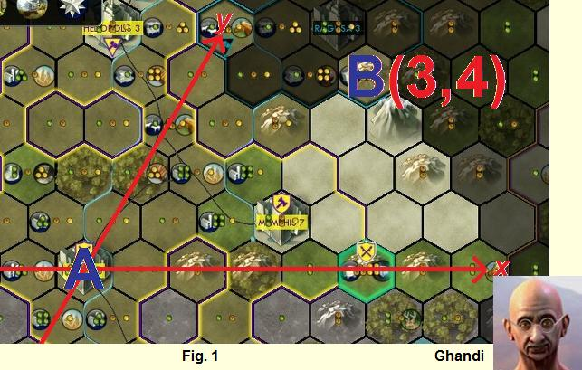

# The number of shortest paths in Civilization V

문제 ID: `CIV5`

## 문제

#### 문제

**Civilization V** has hexagonal grids, different from the previous **Civilization** game series.

You would like to know the number of shortest paths from grid cell A to grid cell B where the grid plane is infinitely large (there is no bound). From each grid cell, you can only move to its one of the six adjacent grid cells, and you can always move to one of them (e.g. nothing prevents you from moving between any pair of adjacent cells).

Two paths from grid cell A to B are considered different if one of the paths visits a grid cell that is not visited by the other path.

## 입력

#### 입력

The first line contains the number of test cases T. Each test case is given by a single line that contains four integers x\_1, y\_1, x\_2, y\_2 where (x\_1, y\_1) denotes the coordinates of cell A and (x\_2, y\_2) denotes the coordinates of cell B. The absolute values of the coordinates will not exceed 100,000.

## 출력

#### 출력

For each test case, output the number of shortest paths from cell A to B. The answers are guaranteed to be no greater than 2^31 - 1.

## 노트

#### 노트
