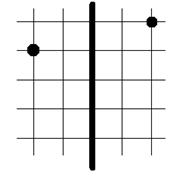

# 정리정돈

문제 ID: `CLEANING`

## 문제

#### 문제

대부분의 KAISTIAN들은 방청소를 하지 않아 기숙사에 물건들이 매우 어지럽게 널려있다. 어느 날, 철수는 방이 너무 더러워 오랜만에 물건들을 깔끔하게 정리정돈하기로 결정하였다. 깔끔하다는 것은 방을 정확히 절반으로 나누는 직선을 $l$ 이라고 할 때 임의의 물건의 위치에서 $l$에 선대칭 시킨 위치에 어떤 물건이 있는 것이다. 이 때, 현재 위치에 있는 물건의 개수와 선대칭 시킨 위치에 있는 물건의 개수가 같아야 한다. 물건들을 옮기는 일은 매우 힘든 일이다. 따라 철수는 물건들을 하나씩 옮기는데 그 거리들의 합을 최소화 하려고 한다. (철수가 물건을 들지 않고 이동하는 거리는 무시하자)

이 문제에선 $l$을 $y$축으로 정의하며, 물건들의 좌표가 2차원상의 좌표로 주어진다고 하자. 철수를 도와서 모든 물건들을 깔끔하게 정리정돈 했을 때, 물건들이 이동하는 거리의 합의 최솟값을 구하자. (거리는 유클리드 거리를 사용한다)

※ 유클리드 거리 $D = \sqrt{(x\_{1}-x\_{2})^{2}+(y\_{1}-y\_{2})^{2}}$

예를 들어, 다음과 같이 물건이 주어진다면 오른쪽의 물건을 1칸 아래로 내리면 정리정돈이 되고, 이때 물건의 이동거리는 1이다.

## 입력

#### 입력

입력은 $T$개의 테스트 케이스로 구성된다. 입력의 첫 줄에는 $T$가 주어진다.  
각 테스트 케이스에 대해, 정수 $N(1 \le N \le 100)$이 주어진다. 그 다음 $N$줄에 각 물건들의 위치가 차례대로 주어진다. 각 좌표는 $-1,000$이상 $1,000$이하의 정수이다. 물건들이 겹쳐있는 경우는 없다.

## 출력

#### 출력

각 테스트 케이스마다 한 줄에 모든 물건들을 깔끔하게 정리정돈 했을 때, 물건들이 이동하는 거리의 합의 최솟값을 소수점 셋째자리까지 반올림해 출력한다.

## 노트

#### 노트
