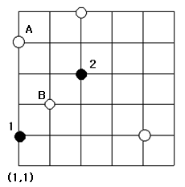

# 동아리방 구별

문제 ID: `CLUBROOM`

## 문제

#### 문제

2차원 평면상에 존재하는 KAIST에는 $M$개의 복지시설과 $N$개의 동아리방(이하 동방)이 있다. 복지시설과 동방은 2차원 상의 좌표 $(x,y)$ 로 표현된다. 가을학기가 개학하고, 동아리연합회에서는 $N$개의 동아리 회장들을 불러 각각 하나의 동방을 선택하게 하였다. $N$명의 동아리 회장들은 도착한 순서대로 $1,2,...,N$ 이라는 번호를 부여받았으며, 번호 $i$를 가진 사람은 $i$번째로 동방을 선택할 수 있게 되었다.

동아리연합회에서는 각 회장들이 어느 동방을 선택했는지 지켜보았고, 그들이 좋은 동방을 선택했는지 조사해보기로 하였다. $i$번째 회장이 선택한 동방을 $A\_i$라 하자. 이 동방이 좋은 동방임은, 앞서 선택된 모든 동방 $A\_1, A\_2, \cdots, A\_{i-1}$ 중 그 어떤 임의의 동방 $A\_j$에 대해서도 모든 편의시설 $P\_k (1 \le k \le M)$에 대해 $\mathrm{dist}(A\_i, P\_k) > \mathrm{dist}(A\_j, P\_k)$ 이지 않음으로 정의된다. 다시 말해 자신보다 앞서 선택한 어떤 동아리방이 모든 편의시설과의 거리가 자신의 선택보다 전부 작다면 그 동방은 나쁜 동방이다. 이 때, 두 지점 사이의 거리는 $\mathrm{dist}((x\_{1},y\_{1}),(x\_{2},y\_{2}))=\max(|x\_{1}-x\_{2}|,|y\_{1}-y\_{2}|)$ 로 정의한다.

예를 들어, 위와 같은 그림에서 검은점이 복지시설, 흰점이 동방들의 후보라고 하자. 1번째 회장이 $(2,3)=B$을 선택하였고, 2번째 회장이 $(1,5)=A$를 동방으로 선택하였다면 $\mathrm{dist}(A,1)=3>1=\mathrm{dist}(B,1), \mathrm{dist}(A,2)=2>1=\mathrm{dist}(B,2)$ 가 되므로 $A$는 나쁜 동방이 된다.

당신에게 복지시설들의 위치, 각 동아리 회장들이 어느 동방을 선택했는지가 도착한 순서대로 주어진다. $N$ 명의 동아리 회장들이 좋은 동방을 선택했는지, 나쁜 동방을 선택했는지 구별해 보자.

## 입력

#### 입력

입력은 $T$개의 테스트 케이스로 구성된다. 입력의 첫 줄에는 $T$가 주어진다.  
각 테스트 케이스에 대해, 복지시설의 개수 $M(1 \le M \le 100)$, 동방의 개수 $N(1 \le N \le 100,000)$이 주어진다.  
그 다음 $M$줄에는 각 복지시설의 좌표가 주어진다. 그리고 그 다음 $N$줄에는 동방의 좌표가 주어진다. 이는 1번째 동아리 회장이 선택한 동방 위치, 2번째 동아리 회장이 선택한 동방 위치, $\cdots$ , $N$번째 동아리 회장이 선택한 동방 위치를 의미한다. 모든 좌표는 1이상 1024이하의 정수이며 서로 좌표가 겹치는 경우는 없다.

## 출력

#### 출력

각 테스트 케이스마다 한 줄에 각 $N$명의 회장이 뽑은 동방이 좋은 동방이면 '`G`' 나쁜 동방이면 '`B`'를 공백으로 구분하여 출력한다.

## 노트

#### 노트
