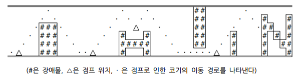

# 코기런

문제 ID: `COGIRUN`

## 문제

#### 문제

태현이는 "코기런"이라는 게임의 기획자이다. "코기런"이라는 게임은 강아지의 일종인 "웰시 코기"가 맵에 등장하는 장애물에 닿지 않고 최대한 멀리까지 도달하는 것이 목적인 게임이다. 고득점을 위해서는 "웰시 코기"를 잘 조종해야 한다.

"코기런"에서는 코기가 맨 왼쪽 맨 아래 칸에서 시작해서, 죽기 전까지 항상 단위시간당 1칸의 속도로 오른쪽으로 전진한다. 플레이어가 코기를 조종할 수 있는 방법은 딱 한 가지인데, 바로 점프이다. 코기가 바닥을 밟고 있을 때, 점프 버튼을 누르면 코기가 맵의 바닥에서 천장까지 단위 시간당 1칸의 속도로 올라갔다가, 천장에 닿으면 단위 시간당 1칸의 속도로 내려간다.

한 번 점프한 후 내려오는 도중에는 다시 점프 버튼을 누르거나 바닥에 도착할 때까지 그대로 기다릴 수 있다. 만약 내려오는 도중 점프 버튼을 다시 누르면 코기가 다시 천장까지 도달했다가 내려오는데, 이를 "2단 점프"라고 부른다. 2단 점프 후에 다시 바닥을 밟기 전까지는 점프할 수 없다.

장애물에 코기가 닿거나 맵의 오른쪽 끝에 도달하면 그 즉시 게임이 끝나고, 코기가 달린 시간이 그 게임의 점수가 된다. (단, 시작점에는 장에물이 존재하지 않는다)

다음 그림은 코기의 점프에 따른 궤적과 플레이 방법을 설명하고 있다.

당신은 태현이와 함께 "코기런"을 만들고 있는 태현이의 동업자이다. 어느 날, 태현이가 "코기런"의 맵을 제작하는 일을 하고 있었다. 불행히도 태현이는 "코기런"을 잘하는 편이 아니기 때문에 게임 중에 계속 실수로 장애물에 부딪히고 말았다. 계속 장애물에 부딪혀 화가 난 태현이는, 당신에게 "코기런"을 최적으로 플레이하  
는 프로그램을 만들어달라고 부탁하였다.

태현이가 만든 맵으로 "코기런"을 최적으로 플레이했을 때 얻을 수 있는 최고의 점수를 계산하는 프로그램을 만들어보자.

## 입력

#### 입력

첫 줄에 태현이가 만든 "코기런"의 맵의 수 M이 주어진다.  
두 번째 줄부터 각 맵의 정보가 차례로 주어진다. 각 맵의 첫 번째 줄에는 맵의 가로 크기 W, 세로 크기 H가 주어진다. 각 맵의 두 번째 줄부터 H개의 줄에는 "코기런"의 맵이 각각 길이가 W인 문자열로 주어진다. 이 문자열은 점( ．) 혹은 #으로 이루어진 문자열로, 점은 코기가 뛰어다닐 수 있는 공간을 의미하고, #  
은 장애물을 의미한다.  
모든 맵은 가로 길이가 500,000 이하이며, 세로 길이는 2 이상 10 이하이다.

## 출력

#### 출력

## 노트

#### 노트
