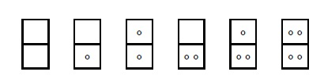

# Domino

문제 ID: `DOMINO`

## 문제

#### 문제

Dominoes are gaming pieces used in numerous tile games. Each doimno piece contains two marks. Each mark consists of a number of spots (possibly zero).  
The number of spots depends on the set size. Each mark in a size N domino set can contain between 0 and N spots, inclusive. Two tiles are considered identical if their marks have the same number of spots, irregardles of reading order. For example tile with 2 and 8 spot marks is identical to the tile having 8 and 2 spot marks. A proper domino set contains no duplicate tiles. A complete set of size N contains all posible tiles with N or less spots and no duplicate tiles. For example, the complete set of size 2 contains 6 tiles:

Write a program that will determine the total number of spots on all tiles of a complete size N set.

## 입력

#### 입력

The first and only line of input contains a single integer, N (1 ≤ N ≤ 1000), the size of the complete set.

## 출력

#### 출력

The first and only line of output should contain a single integer, total number of spots in a complete size N set.

## 노트

#### 노트
