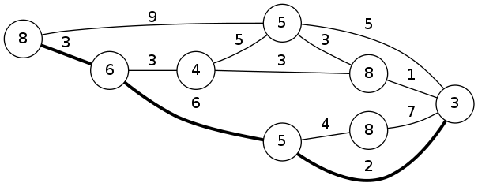

# Drunken Driving

문제 ID: `DRUNKEN`

## 문제

#### 문제

As the holiday season approaches, the number of incidents caused by Driving While Intoxicated (known as DWI) increases rapidly. To prevent this, the city of Seoul has proclaimed a war against drunken driving. Every day, the city will pick a spot at random, and inspect all the drivers passing by.



In this problem, the downtown of Seoul is modeled as a set of V locations and E bidirectional roads connecting them as in the above figure. Each road is marked with the time required to travel along the road. Each location is marked with the expected delay in case the inspection takes place at this location.

While the inspection is all good for everybody’s safety, this may cause unwanted delays in travel. Hyoseung is right now at location A, and he is late for his appointment with his friends at location B. Help him by finding a path which has the smallest expected time, or he must buy the dinner.

The expected time of a path is defined as follows:

```
[Expected time] = [Travel time along the edges] + [Delay caused by inspection]
```

As Hyoseung does not know where the inspection is taking place, we will calculate the worst expected time by assuming the inspection is done at the location which will cause the largest delay.

However, we can assume that the we will not be delayed by any inspections done at the staring or ending location.

For example, see the path marked with thicker lines. It will take 3 + 6 + 2 = 11 minutes to travel along the roads. Since we assume inspections at starting and ending places will not affect us, we will only consider two locations. As we don’t know which of the two places will be inspected, we will play it safe and assume the worst case - we will be inspected at the first place to get 6 minutes of delay. Therefore, the expected time of this path is 17. Write a program to calculate the smallest expected time from place A to B.

## 입력

#### 입력

Your program is to read from standard input. The input consists of a single map of Seoul and T test cases.

The number of places V (1 <= V <= 500), the number of roads E(1 <= E <= V  (V + 1)/2) are given in the first line of the input. A list of V natural numbers follows, and i-th number in this list denotes the delay caused by drunken driving inspection at this place. After that, E lines follow, each contains three integers A, B and C. (1 <= A,B <= V ). The next line will the number of test cases T(1 <= T <= 1000). T test case will follow: each test case will consist of two integers A and B (1 <= A,B <= V ), and they denote the place Hyoseung is currently at, and the place his friends are waiting at.

Assume every vertex is reachable for all other vertices, using one or more roads. All times given do not exceed 100.

## 출력

#### 출력

For each test case, print a single integer which is the smallest worst time to go from A to B.

## 노트

#### 노트
