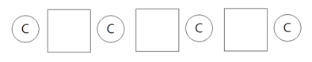

# 쿠키를 먹자

문제 ID: `EATCOOKIE`

## 문제

#### 문제

KAIST 전산학과에서는 어린이날을 기념해 런 유치원에 다니는 어린이들을 학교에 초대하였다. 런 유치원 어린이들이 쿠키를 좋아한다는 사실을 알고 있던 준성이는 깜짝 선물로 쿠키를 준비했다. 단, 이를 직접 나누어 주는 대신 어린이들이 앉을 의자 옆에 미리 배치를 해놓기로 하였다. 어린이들이 앉을 의자는 한 줄로 나열되어있으며 각 의자 사이와 양 끝에는 쿠키가 하나씩 놓여 있다. 아래의 그림은 의자가 3개 일 때 쿠키가 놓여 있는 모습을 나타낸다.

  
위 그림에서 네모는 의자, 원은 쿠키이다.

$N$명의 어린이들은 $1$번부터 $N$번까지 번호를 가지고 있으며 번호가 작은 순서대로 한 명씩 빈 의자에 앉는다. 어떤 의자는 지정석으로 그 의자에 앉을 어린이가 정해져 있어 다른 어린이들은 앉지 못한다고 한다. 어린이들은 욕심이 많아서 의자에 앉자마자 자신의 바로 옆에 있는 쿠키들을 모두 먹는다. 그러나 쿠키를 먹지 못한 어린이는 울기 시작한다. 어린이들의 우는 소리를 듣기 싫어하는 준성이는 어린이들이 모두 의자에 앉았을 때 우는 어린이가 없는 것을 원한다. 어린이들이 준성이가 원하는 대로 의자에 앉는 경우의 수를 구해보자. 단, 경우의 수가 매우 클 수 있으니 $1,000,000,007$로 나눈 나머지를 구해야 한다.

## 입력

#### 입력

첫 번째 줄에 테스트케이스의 수 $T$가 주어진다.   
각 테스트 케이스 마다 첫째 줄에 의자의 개수 $N(1 \le N \le 100,000)$이 주어진다. 두 번째 줄에는 각 의자에 앉을 어린이의 정보를 나타내는 $N$개의 정수 $A\_i (0 \le A\_i \le N)$가 주어진다. $A\_i$가 $0$인 경우에는 아무나 앉아도 상관없는 의자이고, 그 외의 경우에는 그 의자에 앉기로 정해져 있는 어린이의 번호가 주어진다. $0$이 아닌 번호는 모두 다름이 보장된다.

## 출력

#### 출력

각 테스트 케이스 마다 어린이들이 준성이가 원하는 대로 의자에 앉는 경우의 수를 $1,000,000,007$로 나눈 나머지를 출력한다.

## 노트

#### 노트
