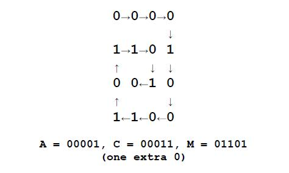

# Encoding

문제 ID: `ENCODING`

## 문제

#### 문제

Chip and Dale have devised an encryption method to hide their (written) text messages. They first agree secretly on two numbers that will be used as the number of rows ($R$) and columns ($C$) in a matrix. The sender encodes an intermediate format using the following rules:

1. The text is formed with uppercase letters [`A`-`Z`] and space.
2. Each text character will be represented by decimal values as follows:
   space = 0, `A` = 1, `B` = 2, `C` = 3, ..., `Y` = 25, `Z` = 26

The sender enters the 5 digit binary representation of the characters’ values in a spiral pattern along the matrix as shown below. The matrix is padded out with zeroes (0) to fill the matrix completely. For example, if the text to encode is: "`ACM`" and $R$=4 and $C$=4, the matrix would be filled in as follows:

The bits in the matrix are then concatenated together in row major order and sent to the receiver. The example above would be encoded as: `0000110100101100`

## 입력

#### 입력

The first line of input contains a single integer $N\,(1 \le N \le 1000)$ which is the number of datasets that follow.

Each dataset consists of a single line of input containing $R\,(1 \le R\le 21)$, a space, $C\,(1 \le C \le 21)$,  
a space, and a text string consisting of uppercase letters [`A`-`Z`] and space. The length of the text string is guaranteed to be $\le (R\times C)/5$.

## 출력

#### 출력

For each dataset, you should generate one line of output with the following values: The dataset number as a decimal integer (start counting at one), a space, and a string of binary digits $(R \times C)$ long describing the encoded text. The binary string represents the values used to fill in the matrix in row-major order. You may have to fill out the matrix with zeroes (`0`) to complete the matrix.

## 노트

#### 노트
