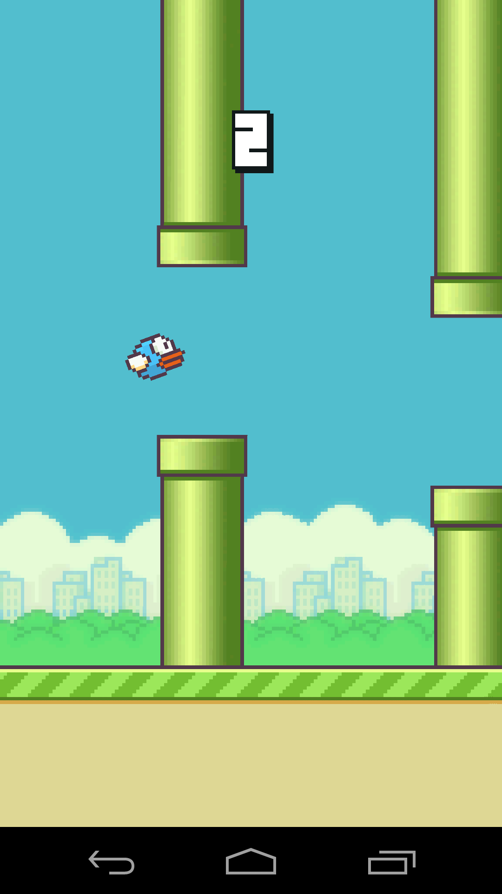

# Flappy Bird

문제 ID: `FLAPPY`

## 문제

#### 문제



Everyone knows about Flappy Bird: it's a mobile game in which you control a bird to fly through a series of pipes without touching them. You are seriously addicted to the game, and have wasted countless hours playing it.

To fight this addiction, you decided to "solve" the game with your programming skills instead. In this task, you have to write an AI for a simplified form of Flappy Bird.

Game Description
----------------

The game level description is given as a grid of size $H \times W$ ($1 \le H \le 20$, $1 \le W \le 1000$). Each cell of this grid is either occupied by a pipe (represented by a '#') or empty (represented by a '.'). Your bird will occupy exactly one cell in the leftmost column, represented by a '@'. Each pipe is a vertical strip of #s, with possibly one or more openings so the bird can pass through. No two adjacent columns will both contain pipes.

So, It looks like this:

```
.....#.....#.....#.....#.....#
.....#...........#...........#
.....#...........#...........#
@..........#.....#.....#......
...........#...........#......
.....#.....#.................#
.....#.....#.....#...........#
```

(Note the 4th pipe has two openings!)

The bird's movement is simulated in time slices. In each time slice, the bird will move exactly one column to the right. Also, you can choose to flap (thus propelling the bird upwards) or stay (the bird will fall to the ground):

* If you choose to flap, the bird will move up by 4 rows(when you reach the top of the game level, you cannot go up further), and its vertical speed will be set to 0.
* If you choose to stay, the bird's vertical speed will be increased by 1; and the bird will move down by the new vertical speed.

At the beginning of the game, your bird has a vertical speed of 0. For example, consider the following level description:

```
.AB...
..C...
......
......
@.....
.D....
......
..E...
```

* If you decide to flap at time #0, you will arrive at the location denoted by A in time #1. Then,
  + If you choose to flap again, you will arrive at B in time #2 (you cannot go above the top of the level).
  + If you choose to stay, you will arrive at C in time #2 (the vertical speed is reset to 0 after flapping).
* If you decide to stay at time #0, you will arrive at D in time #1. Then,
  + If you choose to flap, you will arrive at C in time #2.
  + If you choose to stay again, you will arrive at E in time #2 (the vertical speed is 2 now).

The game is over when you arrive at a cell occupied by a pipe, move below the bottom row, or move past the rightmost column.

Task
----

Find the maximum score you can achieve given a level description. Your score is the number of the time slices you have played. For example, if you collided into a pipe after flapping just once, your score is 1.

## 입력

#### 입력

The number of test cases $C$ ($1 \le C \le 100$) will be given in the first line of the input.

Each test case will begin with two integers $H$ and $W$ ($1 \le H \le 20$, $1 \le W \le 1000$). Then, the following $H$ lines will contain the level description, from the top row to the bottom row. It will be formatted as described above.

## 출력

#### 출력

For each test case, print one integer, that is the maximum score achievable with an optimal AI player.

## 노트

#### 노트
