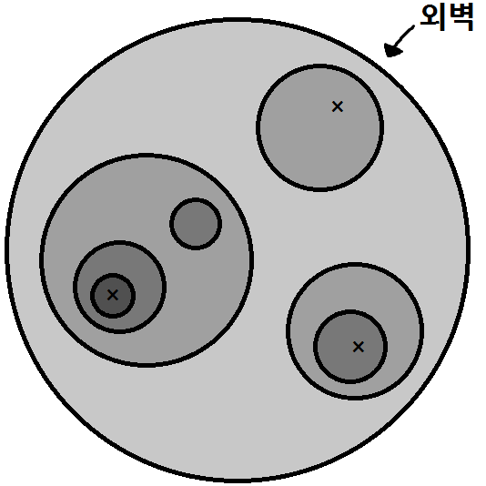
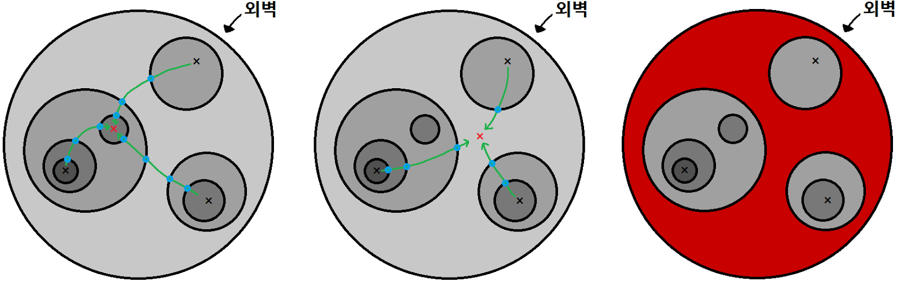
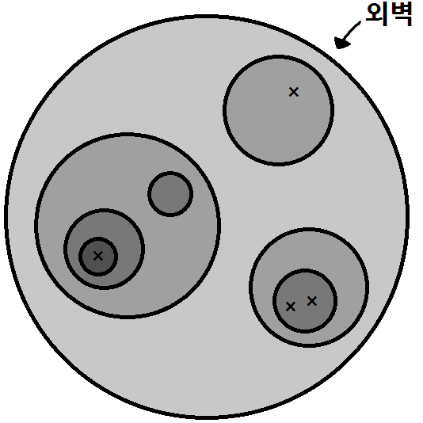
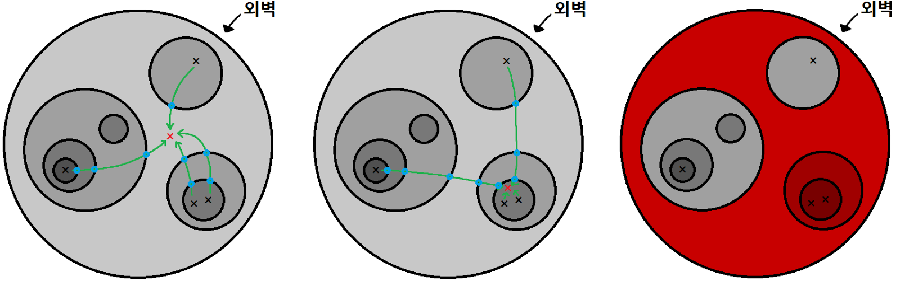

# 요새 2

문제 ID: `FORTRESS2`

## 문제

#### 문제

중세의 성과 요새들은 보안을 튼튼히 하면서도 더 넓은 영역을 보호하기 위해 여러 개의 성벽을 갖고 있었다고 한다. 전세계에서 가장 편집증이 심한 영주가 지은 스트로고(Strawgoh) 요새는 이의 극치를 보여준다.

  
그림 1. 요새

이 요새는 그림 1과 같이 커다란 원형 외벽 내에 여러 개의 원형 성벽이 겹겹이 지어진 형태로 구성되어 있는데, 어떤 성벽에도 문이 없어서 성벽을 지나가려면 사다리를 타고 성벽을 오르내려야 한다. 욕심이 많은 이 성의 영주는 각 주민이 성벽을 한 번 오르내리는 데에 통행세를 거두고 있어 원성이 자자하다. 그렇기에 이에 반발하는 몇몇 주민들은 영주를 성토하기 위한 비밀 집회를 계획하고 있고, 요새의 한 위치에 모이기로 했다. 이 때, 모든 집회에 참여하는 모든 주민이 지불할 통행세의 총합을 최소화 하고 싶어 한다.

  
그림 2. 상황 1

예를 들어 그림 2 처럼 세 명의 주민이 비밀 집회를 하려고 한다고 생각해 보자. $\times$ 표시는 각 주민의 현재 위치를 나타낸다. 실제로는 각 성벽의 통행세가 다를 수 있지만, 이 상황에서는 모든 성벽의 통행세가 같다고 생각하자.

  
그림 3. 상황 1 설명

그림 3은 상황 1에서 비밀 집회를 가지는 위치에 따른 결과를 나타낸다. 파란색 점이 성벽을 오르내리는 지점이다. 가장 왼쪽의 그림은 총 10회를 오르내려야 하며 최적의 경우가 아니다. 중간에 있는 그림은 총 6회를 오르내리야 하며 이 때 가장 최적이 된다. 가장 오른쪽의 그림은 최소화된 통행세로 집회를 할 수 있는 영역을 붉은 색으로 칠한 그림이다.

  
그림 4. 상황 2

다음으로 그림 4는 그림 2의 경우에서 한 명의 주민이 더 끼어든 상황을 나타낸다. 어떤 영역 내에(심지어 같은 위치에도) 여러 주민이 있을 수 있기 때문에 이런 경우도 충분히 가능하다.

  
그림 5. 상황 2 설명

그림 5는 상황 2에서 비밀 집회를 가지는 위치에 따른 결과를 나타낸다. 가장 왼쪽의 그림은 총 8회를 오르내려 최적인 경우이다. 그러나 이 상황에서는 다른 성벽 영역에서 집회를 해도 최적이 될 수 있는데, 중간에 있는 그림이 이를 나타내며 역시 똑같이 8회를 오르내리면 된다. 가장 오른쪽의 그림은 최소화된 통행세로 집회를 할 수 있는 영역을 붉은 색으로 칠한 그림이다.

성벽들의 정보와 주어질 때 비밀 집회에 참가하는 사람들의 위치를 나타내는 상황이 여럿 주어질 때, 어떤 위치로 모든 사람이 모이기 위해 성벽을 오르내리는데 드는 통행세의 총합을 최소화 하고, 그것이 가능한 집회 장소 영역의 넓이를 구하는 프로그램을 작성하라.

## 입력

#### 입력

첫 번째 줄에 성벽의 수를 나타내는 정수 $N$ ($1 \le N \le 10^5$)이 주어진다.

두 번째 줄부터 $N$개의 줄에 걸쳐 $i$번쨰 줄에 $i$번 성벽의 정보인 네 정수 $x\_i$, $y\_i$, $r\_i$, $c\_i$ ($-10^8 \le x\_i, y\_i \le 10^8$, $1 \le r\_i \le 10^8$, $1 \le c\_i \le 10^6$)가 공백으로 구분되어 주어진다.이 때, $i$번 성벽은 $(x\_i, y\_i)$를 중심으로 하는 반지름 $r\_i$인 원형으로 설치되어 있으며 오르내리는데 드는 통행세가 $c\_i$임을 나타낸다. 편의상 모든 성벽의 두께는 $0$이라고 가정하며, 어느 두 다른 성벽에서 잡은 임의의 두 점은 주민의 통행을 위해 최소 $1$이상의 거리를 가지는 것이 보장된다. 입력에서 가장 반지름이 큰 원은 다른 모든 원을 포함하는 외벽이다. 외벽은 $(0, 0)$을 중심으로 하는 반지름 $10^8$인 원 안에 포함된다.

$N + 2$번째 줄에는 상황의 수를 나타내는 정수 $Q$ ($1 \le Q \le 2 \times 10^5$)가 주어진다.

$N + 3$번째 줄부터는 $Q$개의 상황에 대한 정보가 주어지는데, 각 상황은 다음과 같은 형식으로 주어진다.

$j$번째 상황의 첫 번째 줄에는 비밀 집회에 참가하는 주민의 수 $M\_j$ ($1 \le M\_j \le 2 \times 10^5$)가 주어진다. $M\_j$의 총합은 $2 \times 10^5$을 넘지 않는다.

$j$번째 상황의 두 번째 줄부터 $M\_j$개의 줄에 걸쳐 $k$번째 줄에 두 정수 $X\_{j, k}$, $Y\_{j, k}$ ($-10^8 \le X\_{j, k}, Y\_{j, k} \le 10^8$)가 공백으로 구분되어 주어진다. 이는 이 상황에서 $k$번째 주민이 있는 곳의 좌표가 $(X\_{j, k}, Y\_{j, k})$임을 나타낸다. 같은 좌표에 위치한 주민이 여러 명 있을 수 있다. 모든 주민은 외벽 안에 위치하며, 최소한 $1$이상의 거리는 이동해야 성벽에 도착할 수 있는 위치에 있다.

## 출력

#### 출력

각 상황에 대해 하나의 줄에 두 정수를 공백 하나로 구분하여 출력하여야 한다. 이 때, 첫 번째 정수는 $j$번째 상황에 주어진 $M\_j$명의 주민이 요새의한 위치에 모이기 위한 통행세 총합의 최솟값, 두 번째 정수는 통행세 총합을 최소화하는 집회 장소 영역의 넓이가 $R \pi$일 때, $R$을 나타내는 값이다.

## 노트

#### 노트
