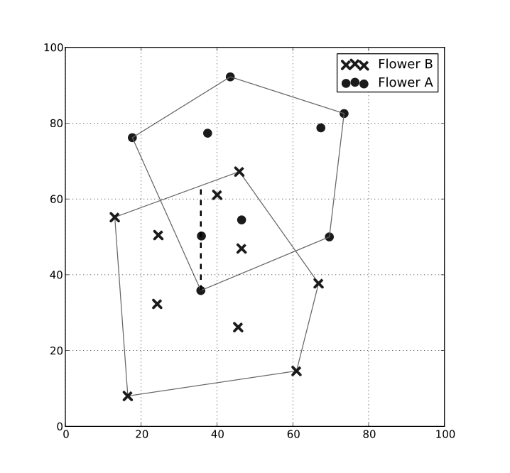

# 꽃가루 화석

문제 ID: `FOSSIL`

## 문제

#### 문제

봄마다 비염 환자들을 괴롭히는 꽃가루는 종종 과거의 기후 변화를 추적하는 데 유용하게 사용됩니다. 퇴적층에서 발견되는 꽃가루 화석을 통해 각 지방의 기후가 어땠는지 확인할 수 있기 때문입니다. 아마추어 고생물학자인 후연이는 서로 다른 환경에서 자라는 두 종류의 꽃 A 와 B 에 대해 각각의 꽃가루가 발견된 위치들을 지도상에 다음 그림과 같이 표시해 보았습니다.

이 지도에서는 y 좌표가 증가하는 방향이 북쪽, x 좌표가 증가하는 방향이 동쪽입니다. 후연이는 각 꽃의 서식지를 예측하기 위해, 해당 화석이 발견된 위치들을 감싸는 최소의 볼록 다각형을 위 그림에 표시된 것과 같이 구했습니다. 이 다각형들을 볼록 껍질(convex hull) 이라고 부릅니다.

후연이는 이 두 개의 볼록 껍질이 서로 겹치는 부분은 과거에 온도 변화가 심했을 것이라는 가설을 세웠습니다. 이 부분이 얼마나 넓은지 확인하기 위해 이 겹치는 부분 중 남북 방향 폭이 가장 넓은 위치를 찾고자 합니다. 예를 들어 위 그림에서는 점선으로 표현된 곳에서 남북 방향의 폭이 가장 넓습니다.

두 개의 볼록 껍질이 주어질 때 겹치는 부분의 남북 최대 폭을 계산하는 프로그램을 작성하세요.

## 입력

#### 입력

입력의 첫 줄에는 테스트 케이스의 수 c (c <= 50) 가 주어집니다. 각 테스트 케이스는 세 줄로 주어집니다. 첫 줄에는 두 볼록 껍질에 포함된 점의 수 n 과 m (1 <= n,m <= 100) 이 주어집니다. 다음 줄에는 2n 개의 실수로 첫 번째 볼록 껍질에 포함된 점의 좌표 (x,y) 가 시계 반대 방향 순서대로 주어집니다. 그 다음 줄에는 2m 개의 실수로 두 번째 볼록 껍질에 포함된 점의 좌표 (x,y) 가 시계 반대 방향 순서대로 주어집니다. 각 좌표는 [0,100] 범위의 실수로, 소수점 밑 최대 2자리까지만 주어집니다.

한 테스트 케이스에는 같은 점이 두 번 들어오지 않으며, 한 직선 위에 있는 세 점이 주어지는 일도 없습니다. 주어진 두 다각형의 모든 내각은 180도 미만입니다.

## 출력

#### 출력

각 테스트 케이스마다 한 줄에, 두 볼록 껍질이 겹치는 부분의 남북 최대 폭을 출력합니다. 만약 두 볼록 껍질이 겹치지 않을 경우 0 을 출력합니다. 정답과 10-7 이하의 절대/상대 오차를 갖는 답은 정답으로 인정됩니다.

## 노트

#### 노트
