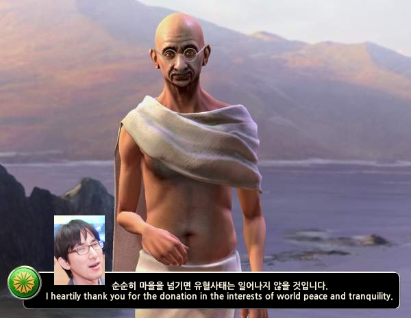

# Gandhi The Conqueror

문제 ID: `GANDHI`

## 문제

#### 문제

Gandhi, one of the most famous conquerors and emperors, wants to conquer a new continent. This continent is rectangular, which is split into H x W square **regions** (think of a grid). Each region in this continent have a **policy**, which describes the culture of that region.

The regions of this continent work in a curious way, as follows:

* In the beginning, each region establishes a **nation** of its own.
* Whenever two nations share an edge and they have the same policy, they unite into a single nation.

Gandhi is the leader of the region located at the left-top corner of the continent. As Gandhi is getting old, he doesn't want violence anymore and wants to unite the whole continent in a peaceful way. His plan is to change his nation's policy every year, so he can unite with the neighboring nations. By this way, he only has to assassinate the leaders of other nations to conquer the whole continent.

Of course, changing a nation's policy takes a lot of time; and Gandhi doesn't want to do that many times. So he asks the Great Coder **ainu7** to minimize the number of changes of the policy.

Given a map of the continent, and the policy of each region, find the minimum number of times Gandhi has to change his nation's policy to unite the whole continent. It doesn't matter what policy Gandhi's nation ends up with.

## 입력

#### 입력

Your program is to read from standard input. The input consists of T test cases.  
The number of test cases T is given in the first line of the input.  
The first line of each test case contains two integers H and W, which denote the height and the width of the continent, respectively (H + W \le 30).  
H lines will follow, each containing W integers between 0 and 4, inclusive.  
These numbers denote the current policy of each region.

## 출력

#### 출력

Your program is to write to standard output. Print exactly one line for each test case.  
The line should contain the number of times Gandhi has to change his nation's policy.

## 노트

#### 노트
