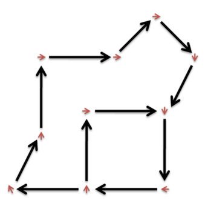

# 강시대소동

문제 ID: `GANGSI`

## 문제

#### 문제

강시는 중국의 흡혈귀이자 일종의 좀비로서 어떤 힘에 의해서 되살아나 피해자의 기를 빼앗거나 피해자를 물어 같은 강시로 만들어 해치는 존재이다. 본래는 객지에서 죽은 자들의 원혼이 깃든 시체를 강시라 하는데, 고향으로 이관하기 위하여 영환술사가 부적을 붙여 움직일 수 없도록 한 후 고향으로 돌려 보내었다고 한다. 시체이므로 몸이 굳어 관절을 구부리지 못하여서 영환술사의 종소리에 맞추어 뛰면서 이동한다고 전해진다.

오래도록 강시에 대해 연구한 한 학자에 의하면, 강시는 알려진 바와 달리 다음의 세 가지 이동 법칙에 의해서만 뛰어다닌다고 한다:

1. 어떤 구간을 계속 순환하기만 한다.
2. 동서남북의 네 방위에 있는 사신들(청룡, 백호, 주작, 현무)의 기운을 이용해서 움직이기 때문에, 맨하탄 거리가 항상 L인 곳으로만 뛰어다닐 수 있다. 두 점 P(xP, yP)와 Q(xQ, yQ) 사이의 맨하탄 거리는 |xP - xQ| + |yP - yQ|로 정의된다.
3. 또한 강시들은 뛸 때 자신이 출발할 당시 자신이 바라보던 방향과 90도 이내의 각도를 이루는 곳으로 뛰어다닐 수 있다. 그뿐만 아니라, 몸의 회전 방향은 이동 방향과 상관없이 조절할 수 있어서 뛰는 도중에 몸을 90도 이내의 범위에서 회전할 수 있다. 예를 들어, 강시가 정동쪽 방향을 보고 있을 때, 정북쪽 방향으로 뛰는 동시에 도착 지점에서 정남쪽 방향을 보고 있을 수 있다.

     
   그림. 강시의 이동법칙에 따른 이동경로 예시(작은 화살표는 발자국의 방향)

윤하가 사는 어느 마을에 갑작스레 강시가 나타났다! 마을의 사람들은 윤하를 지키기 위해 강시 전문가인 여러분을 찾아왔다. 여러분은 찍힌 발자국들을 통해 강시의 경로를 추측하기로 하였는데, 사람들의 발자국과 강시들의 발자국이 함께 뒤엉켜있어 이를 구분하기 어렵다.

발자국을 토대로 추측했을 때 강시의 수가 지나치게 많으면 조사가 너무 어려워지므로, 이를 해결하기 위해 발자국으로부터 존재할 수 있는 최소한의 강시의 수를 찾아내는 프로그램을 작성하라.

## 입력

#### 입력

입력은 T 개의 테스트 케이스로 구성된다. 입력의 첫 줄에는 T가 주어진다.

각 테스트 케이스의 첫 줄에는 두 정수로 강시의 이동거리 L(0 < L <= 10)과 발자국의 개수 N(1 <= N <= 50,000)이 공백으로 구분되어 주어진다.  
이후 N개의 줄에 걸쳐 각 줄마다 각 발자국의 정보를 의미하는 세 정수 x, y, t가 공백으로 구분되어 주어진다. (x, y)는 발자국의 위치이고, t는 발자국의 방향을 x축으로부터의 동경으로 표현한 60분법 각도이다. (-500,000 <= x, y <= 500,000, 0 <= t < 360) 즉 t가 0이면 동쪽, 90이면 북쪽, 180이면 서쪽, 270이면 남쪽으로 향한 발자국을 의미한다. 같은 위치에 여러 발자국이 존재하는 경우는 없다.

## 출력

#### 출력

각 테스트 케이스마다 한 줄에 하나씩 존재할 수 있는 최소한의 강시의 수를 출력한다.

## 노트

#### 노트
