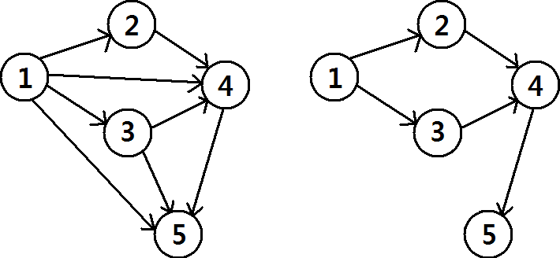

# Graph Connectivity

문제 ID: `GRAPHCON`

## 문제

#### 문제

A directed graph G(V,E) is a mathematical structure consisting of two sets V and E. V = {1, 2, · · · , n} is the set of nodes, and E  V × V is the set of edges. A pair of nodes (u, v) is in E if and only if there is a directed edge from a node u to v.

Given a directed graph G(V,E), we define a connectivity set C(G)  V ×V . A pair of nodes (x, y) is in C(G) if and only if there is a directed path from node x to y.

Given a directed graph, it is easy to compute the connectivity set. This problem is about the opposite direction: Given a directed graph G(V,E), find a graph G0(V,E) which has the same connectivity set(C(G) = C(G0)) and has the least number of edges.

The left figure illustrates a graph G with n = 5, E = {(1, 2), (1, 3), (1, 4), (1, 5), (2, 4), (3, 5), (3, 5), (4, 5)}. The connectivity set C(G) is {(1, 2), (1, 3), (1, 4), (1, 5), (2, 4), (2, 5), (3, 4), (3, 5), (4, 5)}. The right figure illustrates a graph G0 with n = 5, E = {(1, 2), (1, 3), (2, 4), (3, 4), (4, 5)}. The connectivity set C(G0) is as same as C(G), and there is no other graph with 4 or less edges which has the same connectivity set.

## 입력

#### 입력

Your program is to read from standard input. The input consists of T test cases. The number of test cases T(1 <= T <= 100) is given in the first line of the input. In the first line of each case, two integer n(1 <= n <= 200) and m(0 <= m <= n^2) will be given. In the next m lines, each element  
of edge set E will be given.

## 출력

#### 출력

Your program is to write to standard output. Print exactly one line for each test case. For each  
test case, print the minimum number of edges.

## 노트

#### 노트
