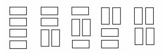

# Tiling a Grid With Dominoes

문제 ID: `GRID`

## 문제

#### 문제

We wish to tile a grid 4 units high and N units long with rectangles (dominoes) 2 units by one unit (in either orientation). For example, the figure shows the five different ways that a grid 4 units high and 2 units wide may be tiled.

Write a program that takes as input the width, W, of the grid and outputs the number of different ways to tile a 4-by-W grid.

## 입력

#### 입력

The first line of input contains a single integer N, (1 ≤ N ≤ 1000) which is the number of datasets that follow.

Each dataset contains a single decimal integer, the width, W, of the grid for this problem instance.

## 출력

#### 출력

For each problem instance, there is one line of output: The problem instance number as a decimal integer (start counting at one), a single space and the number of tilings of a 4-by-W grid. The values of W will be chosen so the count will fit in a 32-bit integer.

## 노트

#### 노트
