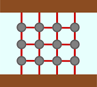
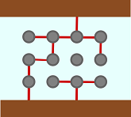
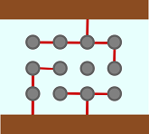

# Grid Islands

문제 ID: `GRIDISLANDS`

## 문제

#### 문제

알고스팟 시의 관광 명소는, 도시의 한가운데를 흐르는 강 위에 격자 모양으로 배치된 섬들과 이들을 잇는 다리입니다. 이 섬들은 세로 N, 가로 N+1의 격자 형태로 배치되어 있으며, 인접한 섬들 사이, 그리고 섬과 강변 사이에는 다리가 설치되어 있어 사람들이 자유롭게 왕복할 수 있습니다.

(a) 파괴되기 전의 다리

(b) 파괴된 후에도 강을 건널 수 있음

(c) 파괴된 후에 강을 건널 수 없음

그림 (a) 는 N=3인 경우 섬들과 이들을 잇는 다리를 보여줍니다. 그러나 어느 여름, 그 이름도 무서운 태풍 '일루' 가 휩쓸고 지나간 뒤, 이 다리들의 상당수가 무참하게 파괴되고 말았습니다. 그런데 다행스럽게도, 파괴되지 않고 남아 있는 다리들만으로 강을 건널 수 있다는 것을 알았습니다. 예를 들어, 그림 (b) 와 같이 다리가 파괴되면 강을 건널 수 있지만, (c) 에서는 강을 건널 수 없습니다. 이와 같은 일이 일어날 가능성이 얼마나 있는지 알아보기 위해, 강을 건널 수 있는 경우의 수가 얼마나 되는지 계산하고자 합니다.

## 입력

#### 입력

입력의 첫 줄에는 테스트 케이스의 수 C (1 <= C <= 30) 가 주어집니다. 그 후 C줄에 하나씩, 섬들을 이루는 격자의 세로 크기 N (1 <= N <= 30) 이 주어집니다.

## 출력

#### 출력

각 테스트 케이스마다 한 줄을 출력하되, 다리들이 파괴된 후에도 강을 건널 수 있는 경우의 수를 20090711 로 나눈 나머지를 출력합니다.

## 노트

#### 노트
