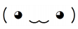

# 그리프시드 모으기

문제 ID: `GRIEFSEED`

## 문제

#### 문제

M 명의 마법소녀가 있습니다. 그들에게는 마스코트 가 있습니다. 마스코트는 한 가지 제안을 합니다.

> 너희는 열심히 하니까 그리프시드라는 보물이 잔뜩 모여 있는 곳을 알려줄게.

그는 지도를 보여 줍니다. 지도는 R행 C열의 행렬로 되어 있었고, 각 칸에는 그 지점에 있는 그리프시드의 개수가 나와 있습니다. 그리고 그는 한가지 조건을 더 붙입니다.

> 하지만 너희 마법소녀들이 보물을 규칙 없이 가져가면 내가 지도를 갱신하는 게 피곤하니까 규칙을 정하자. 축과 평행한 직사각형 영역을 미리 정하고, 거기 있는 걸 전부 가져가는 것을 허락할게.

마법소녀들은 수군댑니다. 그 중 가장 쿨한 마법소녀는 이런 제안을 합니다.

> 우리끼리 싸우면 곤란하잖아? 그러니까 영역에 포함된 그리프시드의 개수가 M 의 배수가 되도록 영역을 정하자.

그러자 욕심이 많은 마법소녀가 말합니다.

> 좋아. 대신 최대한 많은 그리프시드를 모을 수 있도록 직사각형 영역을 정해보자.

그런데 마법소녀들은 어느 영역을 골라야 의 조건과 두 마법소녀의 제안을 만족하게 할 수 있을지 지도가 너무 방대해서 알 수 없게 되어버렸습니다. 여러분이 이 마법소녀들이 적절한 영역을 고를 수 있도록 도와주세요.

## 입력

#### 입력

입력은 여러 개의 테스트 케이스로 구성된다. 입력의 첫 행에는 테스트 케이스의 수 T 가 주어진다.

각 테스트 케이스의 첫 행에는 세 정수 R, C (1 ≤ R, C ≤ 300)와 M (1 ≤ M ≤ 100, 000)이 공백으로 구분되어 주어진다. 다음 R 행에 걸쳐 한 행에 음이 아닌 정수가 C 개씩 주어지며, 이는 행렬로써 지도에 나온 그리프시드의 개수를 의미한다. 모든 그리프시드의 개수의 합은 32비트 부호형 정수로 표현 가능하다.

## 출력

#### 출력

각 테스트 케이스에 대해 한 행에 하나씩 조건을 만족시켰을 때 얻을 수 있는 그리프시드의 개수를 출력한다.

만약 조건을 만족하는 영역이 존재하지 않는다면 0을 출력한다.

## 노트

#### 노트
