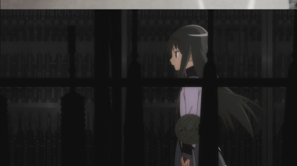

# 호무라의 군수창고 습격

문제 ID: `HOMURAARSENAL`

## 문제

#### 문제

"호무라"는 무기 수집가이다. 호무라는 탁월한 능력을 갖추고 있는 마법소녀이기도 하다. 따라서 무기를 모으거나 위기를 모면하는 것은 이미 호무라에게는 익숙한 일상일 뿐이었다.

하지만 그런 그녀도 실수를 하는 법이라, 얼마 전에 자신의 능력을 잘못 사용하여 그동안 모은 무기를 모두 잃어버리고 말았다.

> 호무,호무· · · · · · . 나의 무기로 가득했던 진열장이 사라지다니 이렇게 슬픈 일이!

슬퍼하던 호무라는 지금 다시 무기를 모으기 위해 군수창고를 습격할 계획을 세우고 있다. 그녀는 이미 습격하고자 하는 군수창고가 무기 보관용 캐비넷 N 개가 일렬로 배치된 형태이며, 각 캐비넷에는 정확히 한종류씩의 무기가 들어 있음을 확인해 두었다. 심지어는, 각 캐비넷에 어떤 무기가 들어 있는지조차 완벽하게 파악해 두었다.

이러한 탈취 작전은 신속하고 정확할 필요가 있다. 그래서 호무라는 신속성을 위해 N 개의 캐비넷 중 연속된 일부분만을 탈취하려 하며, 탈취한 무기들의 종류가 정확히 K 종류가 되도록 하자고 스스로에게 다짐했다.   
호무라가 무기를 가져올 수 있는 방법은 몇 가지나 있을까?

## 입력

#### 입력

입력은 여러 개의 테스트 케이스로 구성된다. 입력의 첫 행에는 테스트 케이스의 수 T 가 주어진다.

각 테스트 케이스는 두 행으로 구성된다. 각 테스트 케이스의 첫 번째 행에는 캐비넷의 개수 N (1 ≤ N ≤ 106 )과 탈취해야 하는 무기의 가짓수 K (1 ≤ K ≤ 106 )가 공백을 사이에 두고 차례로 주어진다. 그 다음 행에는 무기의 종류를 나타내는 번호 Ai (1 ≤ Ai ≤ 109 ) 가 N 개 캐비넷이 배치된 순서대로 주어진다.

## 출력

#### 출력

각 테스트 케이스에 대해 한 행에 하나씩 목적을 달성할 수 있는 구간의 경우의 수를 출력한다.

## 노트

#### 노트

두 번째 테스트 케이스는 <1, 2>, <1, 2, 2>, <2, 2, 4>, <2, 2, 4, 2>, <2, 4>, <2, 4, 2>, <4, 2>, <2, 3>, <3, 1>으로 아홉  
가지가 있다.
