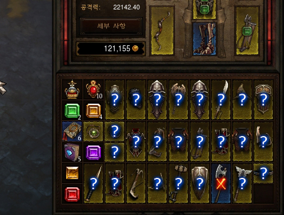

# Inventory

문제 ID: `INVENTORY`

## 문제

#### 문제

Diablo 3 (which is so out of fashion now that only oldies play it) is all about collecting good items. In this game, each player has a bag organized as a grid with 6 rows and 10 columns.



이래봐야\_득은\_없습니다.jpg

As you can see in the picture above, all items are of size $1 \times 1$ or $2 \times 1$. Items cannot overlap or be rotated.   
The game has a variety of items with different sizes, but in this problem we only consider two kinds of items: rings (of size $1 \times 1$) and daggers (of size $2 \times 1$). Furthermore, the game allows multiple items of the same kind to be "stacked", but we will ignore that feature in this problem.

When the player picks up a new item, the item is placed in the bag according to the following simple algorithm dependent on the size of the item:

* If the new item's size is $1 \times 1$: Starting from the left top cell of the bag, look for an empty cell from top to bottom first, and then left to right. The item is placed into the first empty cell found.
* If the new item's size is $2 \times 1$: Starting from left top cell of the bag, look for two vertically adjacent empty cells from left to right first, then top to bottom. The item is placed into the first 2-vertically-adjacent-empty cells found.

Because of the algorithm above, you might not be able to pick up an item even if the bag is not full, if you pick up items in the wrong order. Consider the following case with a $2 \times 2$ small bag, with an item of size $1 \times 1$ placed in the upper right cell. What happens when you pick up a ring and a dagger?

> ```
> . X
> . .
> ```

If you pick up the dagger first, both items would fit in the bag. However, if you pick up the ring first, there will be no room for the dagger to be placed in the bag.

Now, suppose you have a bag of size $R \times C$, and there are $N$ rings and $M$ daggers that you want to pick up.   
You would like to calculate the number of orderings that allow you to pick up all items. Assume that items of the same type are indistinguishable when counting the number of orderings, since those are unidentified yet. See the sample test case for clarification.

## 입력

#### 입력

The input consists of $T$ test cases. $T$ will be given in the first line of the input file, and $T$ test cases will follow.

Each test case starts with a line with 4 integers, $R, C \,(1 \le R, C \le 15)$, $N$ and $M\,(0 \le N, M \le 225)$. The next $R$ lines will tell you the current state of the bag. Each line denotes a row in the bag, and a '`.`' represents an empty cell, and a '`X`' represents a cell occupied with an item.

## 출력

#### 출력

For each of the test case, print the number of orderings which will let you pick up all items, MOD 20130817.

## 노트

#### 노트

대회가 끝나고 공개되었던 풀이입니다. 풀이의 도움을 받지 않고 문제를 해결한다면 훨씬 더 도움이 되겠죠? :)

$DP[n, m, r, c]$ 를 잡아 경우의 수를 계산합니다. $1 \times 1$ 아이템 $n$개, $2 \times 1$ 아이템 $m$개를 획득하였는데 가방의 왼쪽 위에서부터 ($1 \times 1$) 아이템을 주우면 채워지는 방향인) 아래쪽으로 계산해 최초로 등장하는 빈칸이 $(r, c)$인 상태입니다.

이러면 가방을 두 영역으로 나누어 생각할 수 있습니다.

* $(r, c)$ 전까지
* $(r, c)$ 이후

이 때 '이전 영역'까지는 가득 채워진 상태이고, $1 \times 1$ 아이템은 무조건 '이전 영역' 안에 포함되어 있을 것이므로 '이전 영역'에 포함된 $2 \times 1$ 아이템의 개수를 알 수 있습니다.

따라서 이전 영역에 포함되지 않은 모든 $2 \times 1$ 아이템은 오른쪽으로 쌓여나갔을 것이므로 위의 변수들만으로 가방의 상태를 온전히 복원할 수 있습니다.
