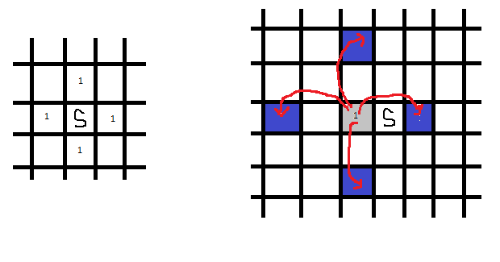

# Jump! Jump!

문제 ID: `JUMP`

## 문제

#### 문제

당신은 현재 무한히 펼쳐진 평면 위의 원점에 위치해 있습니다. 당신은 하루에 한 번씩 점프를 할 수 있는데, 동/서/남/북 중의 한 방향을 정해서 점프할 수 있습니다.

첫 번째 날에는 한 칸을, 두 번째 날에는 두 칸을, …, 이렇게 K 번째 날에는 정확히 K칸 만큼 뛸 수 있습니다. (K칸 보다 작게 뛸 수는 없습니다.)

K 번째 날이 지난 후 (즉, K 칸 만큼 뛴 이후에) 당신이 도착할 수 있는 위치의 경우의 수를 구하세요.

왼쪽 그림은 시작 위치에서 하루가 지났을 때 도달할 수 있는 지역을 나타내고, 오른쪽 그림은 이틀째가 되었을 때, 시작위치에서 왼쪽 점에서 갈 수 있는 지역을 나타낸 그림입니다.

## 입력

#### 입력

입력의 첫 줄에는 테스트 케이스의 수 T가 주어집니다. 각 테스트 케이스는 정수 숫자 K(0 ≤ K ≤ 1,000)으로 구성되어 있습니다..

## 출력

#### 출력

각 테스트 케이스마다 위치할 수 있는 경우의 수를 20130728로 나눈 나머지를 출력합니다.

## 노트

#### 노트
