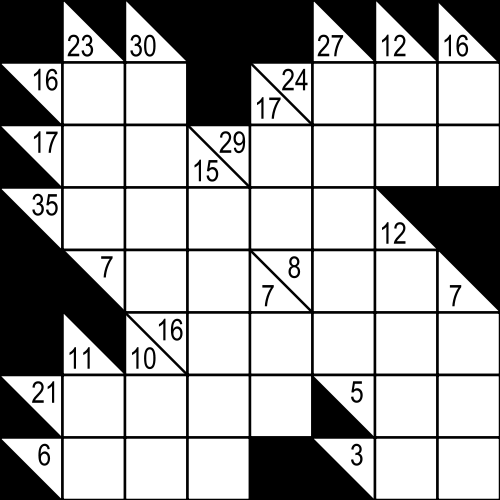

# Kakuro I

문제 ID: `KAKURO1`

## 문제

#### 문제

카쿠로는 흔히 십자말풀이 수학 버전이라고 불리는 논리 퍼즐이다. 카쿠로는 위와 같이 생긴 정사각형의 게임판을 가지고 하는 퍼즐로, 이 게임판의 각 칸은 흰 칸이거나, 검은 칸이거나, 힌트 칸이다. (힌트 칸은, 대각선으로 갈라져 있고 숫자가 씌여 있는 칸을 말한다) 모든 흰 칸에 적절히 숫자를 채워 넣어 규칙을 만족시키는 것이 이 게임의 목표이다.

카쿠로의 규칙은 다음과 같다.

* 모든 흰 칸에는 1 부터 9 까지의 정수를 써넣어야 한다.
* 세로로 연속한 흰 칸들의 수를 모두 더하면, 그 칸들의 바로 위에 있는 힌트 칸의 왼쪽 아래에 씌인 숫자가 나와야 한다.
* 가로로 연속한 흰 칸들의 수를 모두 더하면, 그 칸들의 바로 왼쪽에 있는 힌트 칸의 오른쪽 위에 씌인 숫자가 나와야 한다.
* 이 때 한 줄을 이루는 연속된 흰 칸들에는 같은 수를 두 번 넣을 수 없다. 예를 들어, 두 개의 흰 칸의 숫자를 더해서 4가 나와야 한다고 하면, 1+3=4 이거나 3+1=4 만이 가능하고, 2+2=4 는 불가능하다.

알고스팟 멤버들은 모의고사를 준비하면서 카쿠로를 푸는 프로그램을 작성하는 문제를 내려고 하는데, 입력 파일 만들기가 너무 힘들어서 입력 파일을 만드는 문제부터 먼저 내기로 했다.

카쿠로 퍼즐의 답이 주어질 때, [Kakuro II](/judge/problem/read/KAKURO2 "Kakuro II")의 입력 양식에 맞춘 입력 파일을 작성하는 프로그램을 작성하라.

## 입력

#### 입력

입력의 첫 줄에 테스트 케이스의 수 T 가 주어진다.

각 테스트 케이스의 첫 줄에는 카쿠로 게임판의 크기 N (N <= 20) 이 주어진다. 카쿠로 게임판은 언제나 정사각형이다. 그 후 N줄에, 각 N개의 정수로 카쿠로 퍼즐의 해답이 주어진다. 힌트 칸이나 검은 칸은 0 으로 주어지고, 흰 칸은 해당 칸에 들어갈 숫자로 주어진다.

## 출력

#### 출력

프로그램의 출력 양식은 Kakuro II 문제의 입력 양식과 정확히 일치해야 한다. 다음은 Kakuro II 문제의 입력 양식이다.

The first line of input file has the number of test cases T.

In the first line of each test case, the size of the game board N (<= 20) is given. The next N lines will give a description of the board, from top to bottom. These lines will have N numbers, where 0 denote black/hint cells, and 1 denote white cells. In the next line, the number of hint Q is given. The following Q lines give the hints on the board, each described with four integers: y, x, direction, and sum. sum is the value of the clue (1 <= sum <= 45), and (y, x) is the 1-based coordinate of the hint cell. direction is 0 if hint clue is a horizontal sum, 1 if the clue is a vertical sum.

단, 이 문제에서는 채점의 편의를 위해 힌트를 정렬된 순서로 출력하기로 한다. 가로 힌트를 세로 힌트보다 먼저 출력해야 하며, 같은 종류의 힌트는 맨 윗 행부터 아래쪽으로, 같은 행 내에서는 왼쪽에서 오른쪽으로 먼저 있는 것 부터 출력해야 한다.

## 노트

#### 노트
