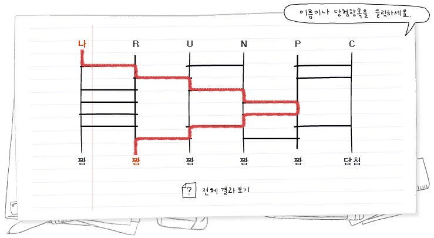

# 운명의 사다리

문제 ID: `LADDER`

## 문제

#### 문제

altertain은 친구들과 가끔 컴퓨터로 사다리 타기 게임을 한다. 그는 사다리 타기를 몇 번 해보고는, 몇 개의 선만 지우면 자신이 당첨될 수 있다는 것을 알았다. 그래서 그는 항상 자신이 당첨되도록 친구들 몰래 프로그램을 조작하려고 한다. 하지만 그는 프로그래밍을 잘 못하기 때문에, ICPC를 준비하며 10분에 한 문제씩 풀고 있는 당신에게 도움을 요청했다.

사다리 모양이 입력으로 주어진다. 1번 사다리로 출발해서 N번 사다리로 도착하게 하려면, 최소 몇 개의 가로 선을 지워야 하는가?

## 입력

#### 입력

첫 번째 줄에는 테스트 케이스의 개수 T가 주어진다. ( T ≤ 60 )  
  
각 테스트 케이스의 첫 번째 줄에는 사다리의 개수 N과 사다리 사이의 가로 선의 개수 M이 주어진다. ( 2 ≤ N ≤ 100, 0 ≤ M ≤ 20000 )  
  
다음 M줄에 걸쳐, 각 가로 선의 정보가 X Y 형태로 주어진다. X Y는 (X, Y)와 (X+1, Y) 사이에 가로 선이 있다는 것을 의미한다. ( 1 ≤ X ≤ N-1, 1 ≤ Y ≤ 1000000 )  
  
가로 선은 서로 붙지 않는다. 다시 말해서 (X, Y)와 (X+1, Y)가 한 테스트 케이스에 들어있는 경우는 없다.  
  
사다리는 Y=0가 출발점이고, 더 이상 가로선을 만나지 않으면 도착한 것으로 간주한다.

## 출력

#### 출력

각 테스트 케이스 당 한 줄씩, 최소로 지워야 되는 가로 선의 개수를 출력한다. 불가능하면 -1을 출력한다.

## 노트

#### 노트

입출력 설명  
첫 번째 케이스는 그림과 같다. (4, 4)를 지우거나, (4, 5)를 지우면 당첨된다.  
두 번째 케이스는 어떤 가로 선을 지우더라도 N번째 사다리에 닿을 수 없다.
