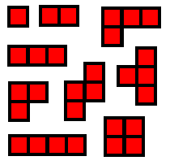
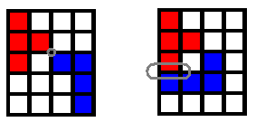

# Mini Blokus

문제 ID: `MBLOKUS`

## 문제

#### 문제

평소에 보드게임을 너무너무 좋아하는 LIBe 는 이번에는 Blokus 에 도전해 보기로 하였다. 하지만 LIBe 는 친구가 많지 않아 대개 혼자 놀기 때문에 원래 형태의 Blokus 를 하기 힘들었고, 고민 끝에 자신만의 게임을 만들기로 했다. LIBe 가 만든 새로운 게임은 N\*M 크기의 게임판에서 진행하며, 이 중 몇 개의 칸에 장애물 블럭을 설치한다. 장애물 블럭이 있는 칸에는 다른 블럭을 놓을 수 없다. LIBe 는 아래의 9가지의 블럭을 가지고 게임을 진행하며, 각 블럭들은 회전/대칭 변환이 가능하다.

* 한 번에 하나의 블럭을 게임판에 놓을 수 있다.
* 첫 번째 블럭은 항상 게임판의 맨 왼쪽 위 칸을 포함하고 있어야 한다. 장애물이 있는 경우에는 게임이 끝난다.
* 두 번째 블럭부터는 자기가 이미 게임판에 놓은 블럭의 꼭지점을 공유하면서 이어나간다. 이 때 자기의 블럭과 변을 공유하면 놓을 수 없다. 예를 들어, 아래의 왼쪽 그림에서는 새 블럭이 이전 블럭과 꼭지점을 공유하기 때문에 그대로 놓을 수 있지만, 오른쪽 그림에서는 변을 공유하기 때문에 불가능하다.

* 더 이상 블럭을 놓을 수 없거나, 모든 블럭을 게임판에 놓은 경우 게임이 종료된다.
* 종료시에 모든 블럭을 게임판에 내려놓았을 경우 50점을 받게 되고, 그렇지 못하면 블럭의 칸수에 따라 감점을 받는다. 예를 들어 1칸짜리 블럭을 놓지 못했으면 -1점을 받고, 3칸짜리 ㄴ 자 블럭을 놓지 못했으면 -3점을 받게 되는 것이다. 블럭을 하나도 놓지 못하면 -29점이 된다.

게임을 시작하기 전 장애물이 배치된 상태의 게임판이 주어질 때, LIBe 가 얻을 수 있는 최대 점수를 구하는 프로그램을 작성하라.

## 입력

#### 입력

첫 줄에는 테스트 케이스의 수 C (1 <= C <= 50) 가 주어진다. 각 테스트 케이스의 첫 줄에는 보드의 크기 N, M (1 <= N,M <= 30)이 주어지고, 그 후 N 줄에 보드의 상태가 주어진다. 한 줄에는 M 개의 문자가 공백없이 주어지며, . 은 빈칸을, \* 는 장애물을 나타낸다.

게임판에 있는 빈칸의 수는 항상 30 이하이다.

## 출력

#### 출력

각 줄에 LIBe 가 얻을 수 있는 최대점수를 출력한다.

## 노트

#### 노트
