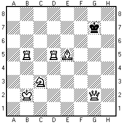

# 변신 체스

문제 ID: `MCHESS`

## 문제

#### 문제

변신 체스는 일반적인 체스 게임과 비슷하게 진행되지만, 킹에게는 변신하는 기능이 있다는 점이 다르다. 변신 체스판의 각 칸에는 일반적인 체스판처럼 어떤 무늬도 새겨져 있지 않을 수도 있고, 특정한 기물의 모양이 그려져 있을 수도 있다. 이 때 킹이 해당 칸에 도달하면 킹은 해당 기물로 변신할지를 선택할 수 있다. 그러면 다음 턴부터 해당 기물의 움직임대로 움직일 수 있다.

텅 빈 변신 체스판 위에 킹만 하나 놓여 있다고 하자. 킹을 특정한 위치로 움직이고 싶다. 이 때 최소 몇 번을 움직여야 해당 위치에 도달할 수 있는지를 계산하는 프로그램을 작성하라. 변신은 움직임으로 치지 않는다.

## 입력

#### 입력

입력의 첫 줄에는 테스트 케이스의 수 C (<= 50) 가 주어진다. 각 테스트 케이스의 첫 줄에는 체스판의 크기 N (8 <= N <= 100) 이 주어진다. 그 후, 킹의 시작 위치 (y1,x1) 과 도착 위치 (y2,x2) 가 순서대로 주어진다. y 는 맨 아래에서부터 몇 번째 줄인지, x 는 왼쪽에서부터 몇 번째 칸인지를 나타낸다. 그 후, N줄에 각 N개의 문자로 체스판이 주어진다. 체스판의 각 칸은 . (마침표), P, B, N, R, Q, K 중 하나다. 각 글자의 의미는 다음과 같다.

* . (마침표) : 해당 칸에는 어떤 글자도 새겨져 있지 않다
* P : 해당 칸에 오면 폰 (Pawn) 으로 변신할 수 있다. 폰은 항상 세로 방향으로 위로 한 칸만 움직일 수 있다.
* B : 해당 칸에 오면 비숍 (Bishop) 으로 변신할 수 있다. 비숍은 대각선 방향으로 한번에 몇 칸이든 움직일 수 있다.
* N : 해당 칸에 오면 나이트 (kNight) 으로 변신할 수 있다. 나이트는 가로와 세로 중 한 쪽으로 2칸, 다른 한 쪽으로는 1칸을 동시에 움직일 수 있다.
* R : 해당 칸에 오면 룩 (Rook) 으로 변신할 수 있다. 룩은 가로와 세로 중 한 방향으로 한번에 몇 칸이든 움직일 수 있다.
* Q : 해당 칸에 오면 퀸 (Queen) 으로 변신할 수 있다. 퀸은 비숍 또는 룩이 움직이는 방향대로 마음대로 움직일 수 있다.
* K : 해당 칸에 오면 킹 (King) 으로 변신할 수 있다. 킹은 현재 칸과 인접한 8개의 칸 중 하나로 움직일 수 있다.

시작 위치에는 항상 . 가 쓰여 있다고 가정해도 좋다.

## 출력

#### 출력

각 테스트 케이스마다 킹이 해당 위치로 도달하기 위해 필요한 최소 움직임의 수를 출력한다.

## 노트

#### 노트
