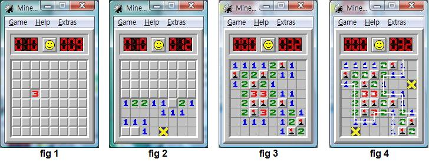

# Minesweeper

문제 ID: `MINESWEEPER`

## 문제

#### 문제

**C0ffee**, a famous hacker, plays Minesweeper game a lot in his spare time. After hours and hours of playing Minesweeper, **C0ffee** finally got bored and wrote a hack program for the game. With this hack, **C0ffee** instantly knows which cells contain mines. **C0ffee** now wants to set a speed record using this hack. But alas, his mouse is broken so he cannot make right clicks. So he must clear the board using left clicks only.

In case you are rusty with Minesweeper, here is a quick refresher on how the game works:

* An empty cell is **opened** when you left click on it.
* When a cell is opened, it will show the number of mines in adjacent cells. Two cells are adjacent if they share an edge or a corner. See figure 1 for an exmple.
* If all the adjacent cells are empty(not containing a mine), all adjacent cells are opened automatically, and this process goes on until no more cells are automatically opened. Figure 2 shows an example; when the cell with X is clicked, all those cells will open at once.

Given a minsweeper board, write a program to compute the minimum number of left clicks **C0ffee** has to make in order to clear the given board.

**Notes**

* Figure 3 describes the second sample input.
* Figure 4 describes the minimum clicks required to clear the board: cells marked with Xs and white dots must be clicked.

## 입력

#### 입력

Your program is to read from standard input. The input consists of T test cases.  
The number of test cases T is given in the first line of the input.  
The first line of each test case contains two integers R and C (1 <= R, C <= 200),  
where R is the number of rows and C is the number of columns.  
The following R lines will each contain C characters, where mines are denoted by an asterisk('\*') and empty cells by a dot('.').

## 출력

#### 출력

Your program is to write to standard output. Print exactly one line for each test case.  
The line should contain an integer indicating the minimum number of left clicks required to clear the board.

## 노트

#### 노트
