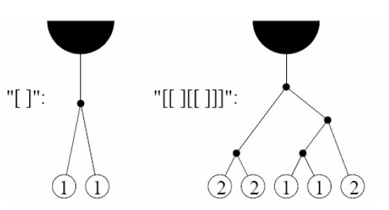

# Monkey Vines

문제 ID: `MONKEY`

## 문제

#### 문제

Deep in the Amazon jungle, exceptionally tall trees grow that support a rich biosphere of figs and juniper bugs, which happen to be the culinary delight of brown monkeys.

Reaching the canopy of these trees requires the monkeys to perform careful navigation through the tall tree’s fragile vine system. These vines operate like a see-saw: an unbalancing of weight at any vine junction would snap the vine from the tree, and the monkeys would plummet to the ground below. The monkeys have figured out that if they work together to keep the vines properly balanced, they can all feast on the figs and juniper bugs in the canopy of the trees.

A vine junction supports exactly two sub-vines, each of which must contain the same number of monkeys, or else the vine will break, leaving a pile of dead monkeys on the jungle ground. For purposes of this problem, a vine junction is denoted by a pair of matching square brackets [ ], which may contain nested information about junctions further down its sub-vines. The nesting of vines will go no further than 25 levels deep.

You will write a program that calculates the minimum number of monkeys required to balance a particular vine configuration. There is always at least one monkey needed, and, multiple monkeys may hang from the same vine.

## 입력

#### 입력

The first line of input contains a single integer N, (1 ≤ N ≤ 1000) which is the number of datasets that follow.  
Each dataset consists of a single line of input containing a vine configuration consisting of a string of [ and ] characters as described above. The length of the string of [ and ] will be greater than or equal to zero, and less than or equal to 150.

## 출력

#### 출력

For each dataset, you should generate one line of output with the following values: The dataset number as a decimal integer (start counting at one), a space, and the minimum number of monkeys required to reach the canopy successfully. Assume that all the hanging vines are reachable from the jungle floor, and that all monkeys jump on the vines at the same time.

## 노트

#### 노트
