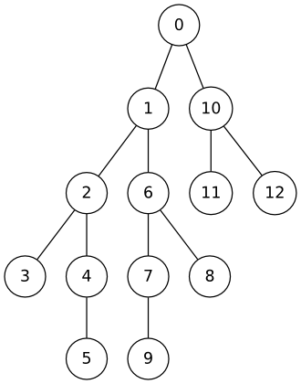

# 내비게이션

문제 ID: `NAVI`

## 문제

#### 문제

알고스팟 국의 고속도로는 0부터 N-1까지의 번호가 매겨진 N개의 대도시를 연결하고 있다. 이 고속도로망의 가장 큰 특징은 고속도로들이 트리 형태를 갖는다는 것이다. 다시 말하면, 두 도시 간을 연결하는 경로는 항상 정확히 하나만 존재한다. 아래 그림은 13개의 도시를 연결하는 고속도로망의 예를 보여준다.

이 고속도로들은 공익을 위해 건설된 것이기 때문에 통행료가 아주 저렴해서, 고속도로를 한 번 탈 때마다 단 1원의 통행료만을 내면 된다.

최근 세수가 부족해진 정부는 통행량에 따라 고속도로의 통행료를 동적으로 바꾸는 법안을 상정했다. 이 법안에 따르면, 교통량이 많을 때는 통행료를 올려서 교통량을 낮추는 효과를 볼 수 있다. 그러나 서민들의 거센 반대에 부딪힌 정부는 다음과 같은 타협안을 제시했다: 두 도시 간을 통행할 때는, 지나는 고속도로의 통행료 중 가장 비싼 한 군데의 통행료만을 내도 상관없다는 것이다.

예를 들어 위 그림에서 0번과 1번 도시 사이의 통행료가 10원, 1번과 2번 사이의 통행료가 15원, 2번과 3번 사이의 통행료가 7원이라면, 0번에서 3번까지 갈 때는 15원의 통행료만을 내면 된다.

서민들의 반대는 잦아들고 모두가 행복한 듯 했지만, 알고스팟 국에서 가장 잘 나가는 내비게이션, 박기사의 서버 개발을 담당하고 있는 대성이는 곤란한 상황에 처했다. 고속도로들의 통행료는 하루에도 수천번씩 바뀔 수 있기 때문에, 두 도시간의 통행료를 계산하기가 훨씬 어려워졌기 때문이다.

박기사의 서버는 통행료 변경 내역을 실시간으로 입력받으며, 중간 중간 두 도시 간의 통행료 계산을 요청받아 반환해야 한다. 이를 계산하는 프로그램을 작성해 대성이를 도와주자.

## 입력

#### 입력

입력에는 C(<=10)개의 테스트 케이스가 주어진다.

각 테스트 케이스의 첫 줄에는 도시의 수 N(2 <= N <= 50000)이 주어진다. N개의 도시는 트리 형태를 가지고 있으며, 0번 도시가 항상 트리의 루트가 된다.

다음 줄에는 N개의 정수로, 0번부터 N-1번까지 각 도시에 대해 부모 도시의 번호가 주어진다. 0번 도시는 루트이므로 부모 도시의 번호 대신 -1이 주어진다. 초기에 모든 고속도로의 통행료는 1원이다.

다음 줄에는 연산의 수 Q (1 <= Q <= 10,000)이 주어진다. 그 후 Q줄에 하나씩 연산이 주어지는데, 연산은 다음 두 형태 중 하나이다:

* `update a b cost`: a도시와 b도시를 연결하는 고속도로의 통행료를 cost원으로 갱신한다. (0 <= a, b < N, 1 <= cost <= $2^{30}$)
* `query a b`: a도시와 b도시 간의 통행료를 계산하라.

**입출력의 양이 많으므로 빠른 입출력 방식을 사용하기를 권장한다.**

## 출력

#### 출력

각 테스트 케이스마다, query 연산의 결과 통행료들을 모두 계산해 그들의 xor를 한 줄에 출력한다.

## 노트

#### 노트

본문의 그림은 두 번째 테스트 케이스를 그림으로 그린 것이다.

두 번째 테스트 케이스에서 첫 번째 query와 두 번째 query의 답은 모두 1, 세 번째 query의 답은 7이 된다. 따라서 이 셋의 xor은 7이다.
