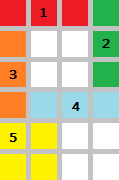

# A New Layout Algorithm

문제 ID: `NEWLAYOUT`

## 문제

#### 문제

Lately, Eunjin is working hard on developing an application that, given a keyword, displays images gathered from the Internet to give the user some insight about the keyword.

Assuming that Eunjin already collected total N rectangular bitmap images of various sizes to display, she has to locate the images in a rectangular view panel that is W pixels wide. The panel will automatically span vertically so that it can fit all images. She uses the following rules to layout the images:

* As a rule of thumb, the images be considered sequentially, according to the given order.
* No image can be rotated.
* No two or more images shall be overlapped.
* For each column of the view panel, the image indices of the non-empty pixels should be in non-decreasing order, when taken from top to bottom. That is, an image with higher index should not be placed above another image with lower index.

+ Among all of the feasible positions of an image, the algorithm must choose the top-most position (for its left-top pixel); if there are ties, choose the left-most one (for its left-top pixel).

The following figure illustrates the sample input. The numbers represent the images. Note that fifth image cannot placed in the 2 by 2 empty pixels surrounded by other four images as doing so will violate the rules above.

Compute the required minimum height of the view panel, given a set of images.

## 입력

#### 입력

Your program is to read from standard input. The input consists of T test cases.  
The number of test cases T is given in the first line of the input.  
The first line of each test case contains two integers N(1 <= N <= 2,000) and W(1 <= W <= 1,920) separated by whitespace(s).  
Each line of the next N lines will contain two integers X\_i(1 <= X\_i <= W) and Y\_i(1 <= Y\_i <= 1,200),  
indicating that the i-th image is X\_i pixels wide and Y\_i pixels high.

## 출력

#### 출력

Your program is to write to standard output. Print exactly one line for each test case.  
The line should contain the minimum height of the view panel required for displaying the given images.

## 노트

#### 노트
