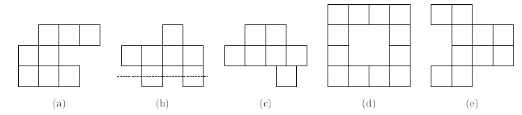

# Nonsymetric Polyominoes

문제 ID: `NPOLY`

## 문제

#### 문제

정사각형들의 변들을 서로 완전하게 붙여 만든 도형들을 폴리오미노 (Polymino)라고 부릅니다. n개의 정사각형으로 구성된 폴리오미노들을 만드려고 하는데, 이 중 세로로 단조 (montone)인 폴리오미노의 수가 몇 개나 되는지 세고 싶습니다. 세로로 단조라는 말은, 어떤 가로줄도 폴리오미노를 두 번 이상 교차하지 않는다는 뜻입니다. 그런데, 미적인 이유 때문에 그 중에서도 세로로 대칭인 폴리오미노는 세고 싶지 않습니다. 이와 같은 조건을 만족하는 폴리오미노의 수를 계산하는 프로그램을 작성하세요.

예를 들어, 위 그림에서 (a)는 정상적인 세로 단조 폴리오미노입니다. 그러나, (b)는 점선이 폴리오미노를 두번 교차하기 때문에 세로 단조 폴리오미노가 아닙니다. (c)는 맨 오른쪽 아래 있는 정사각형이 다른 정사각형과 변을 완전히 맞대고 있지 않기 때문에 폴리오미노가 아닙니다. (d)는 내부에 빈 공간이 있는 폴리오미노로, 세로 단조 폴리오미노가 아닙니다. (e)는 세로 단조 폴리오미노이지만, 세로로 대칭이기 때문에 세지 않습니다.

## 입력

#### 입력

입력의 첫 줄에는 테스트 케이스의 수 C (1 <= C <= 50)가 주어집니다. 그 후 각 줄에, 폴리오미노를 구성할 정사각형의 수 n (1 <= n <= 100)가 주어집니다.

## 출력

#### 출력

각 테스트 케이스마다, n 개의 정사각형으로 구성된 세로 단조 폴리오미노 중 세로 대칭이 아닌 것의 수를 출력합니다. 이 수가 20090711보다 같거나 클 경우 20090711로 나눈 값을 출력합니다.

## 노트

#### 노트
