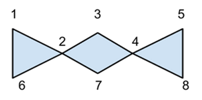

# 오리 독감

문제 ID: `ORIVIRUS`

## 문제

#### 문제

KAIST에 무시무시한 전염병 "오리 독감"이 돌고 있다!

사실 "오리 독감"은 바이러스를 통해 전염되는데, KAIST의 대학원생들의 혼신의 노력 끝에 전염 조건을 밝혀내고야 말았다. 특이하게도, 이 바이러스는 친구 중에 두 명이 감염되면 자신도 무조건 감염된다고 한다.

학교 당국은 전염병이 더 퍼지는 것을 막기 위해 대책을 세우기로 하였다. 그러나 정확히 무엇을 대비해야 할 지 몰랐기 때문에, 여러 가지 시나리오를 세우고 각각 대비하기로 하였다.

학교에서 준비하고 있는 시나리오란, "어떤 학생 A와 B가 오리 독감의 최초 발병자라고 가정할 때, 전염병에 걸렸을 것으로 예상되는 모든 학생을 격리시키는 것"이다. 사실 학교는 모든 학생들을 철저히 감시하고 있기 때문에, 모든 KAIST 학생들의 친구 관계를 알고 있다(!). 따라서 이론적으로는 각 시나리오에 대해서 최종적으로 어떤 사람들이 전염병에 걸릴지 완벽히 예측할 수 있다. 유일한 문제는, 직원들이 손으로 계산하기엔 KAIST의 학생 수가 너무 많다는 것이다.

전교 학생들의 친구 관계와 가능한 시나리오들이 주어질 때, 각 시나리오마다 전염병 환자가 몇 명 발생하는지를 예측하는 프로그램을 작성해서 직원들을 도와주도록 하자.

## 입력

#### 입력

입력은 $T$개의 테스트 케이스로 구성된다. 입력의 첫 줄에는 $T$가 주어진다.

각 테스트 케이스에 대해, KAIST 학생들의 수 $N(1 \le N \le 100)$이 주어진다. 다음 $N$개의 줄에는 각각 $N$개의 0 또는 1이 주어진다. 이는 각 학생들의 친구 관계 $F(i,j)$를 나타내는데, $F(i,j)$가 1이면 $i$와 $j$는 친구이고, 0이면 친구가 아니다. $F(i,i)$는 항상 0이고, $F(i,j)$는 항상 $F(j,i)$와 같다.

다음 줄에는 시나리오의 수 $M(1 \le M \le 100)$이 주어진다. 다음 $M$개의 줄에는 각각 두 개의 숫자가 주어진다. 이 숫자는 그 시나리오에서의 최초 발병자를 나타낸다. 각 학생들의 번호는 $1$번 이상 $N$번 이하이고, 두 개의 숫자는 서로 같지 않다. 모든 시나리오는 서로 독립적이다.

## 출력

#### 출력

각 테스트 케이스마다 한 줄에 $M$개의 시나리오에서 최종적으로 전염병에 걸리는 환자의 수를 나타내는 정수를 공백을 사이에 두고 출력한다.

## 노트

#### 노트

예제 설명(두번째 예제)  
  
  
시나리오 1:  
1, 3이 감염된 경우 가장 먼저 2가 감염되고, 1과 2에 의해 6이 감염된다.  
시나리오 2:  
1, 8이 감염된 경우 추가 감염자는 존재하지 않는다.  
시나리오 3:  
5, 8이 감염된 경우 4만 감염된다.
