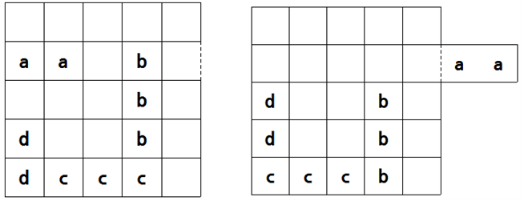

# 주차장

문제 ID: `PARKINGLOT`

## 문제

#### 문제

석주는 지도교수님에게서 자신의 차를 주차장에서 가져오라는 부탁을 받았다. 석주는 주차장에 갔더니 주차장이 다음의 왼쪽 그림과 같이 $5$ X $5$ 의 격자 형태로 되어있다는 것을 알 수 있었다.

현재 주차장에 있는 모든 차는 $1$ X $N$이나 $N$ X $1$꼴로 존재하며 $N$은 $2$이상의 정수이다. 가로가 더 긴 차들은 좌우로만 이동할 수 있으며, 세로가 더 긴 차는 위아래로만 이동할 수 있다. 석주의 지도교수님 차는 알파벳 ‘a’로 이루어진 차이며 이를 가장자리에 있는 유일한 출구를 통해 주차장 밖으로 꺼내야 한다. 주차되어 있는 모든 차는 움직일 수 있게 되어있기 때문에 석주는 차들을 최소의 횟수로 이동시키며 교수님의 차를 빼내어야 한다.   
단, 다른 차들이 출구로 나오면 안 되며 총 횟수는 각 차들이 움직인 거리의 합을 의미한다.

위의 예제에서의 출구는 두 번째 줄 가장 오른쪽에 유일하게 존재한다. 먼저 'd' 차를 위로 한 칸, 'c' 차를 왼쪽으로 한 칸, 'b' 차를 아래로 한 칸을 움직인 뒤에 교수님 차인 'a' 차를 5칸 움직이면 차를 주차장에서 완전히 빼낼 수 있다. (오른쪽 그림과 같이) 총 8칸을 움직였으며 이보다 더 적은 차의 이동횟수로 목적을 달성할 수는 없다.

초기 주차장의 상태가 주어졌을 때, 차들을 최소 몇 번 이동시켜야 교수님 차를 주차장에서 빼낼 수 있는지를 출력하여라.

## 입력

#### 입력

첫 줄에는 테스트 케이스의 수 $T$가 주어진다.  
각 테스트케이스에 대해 첫 개의 $5$줄에는 주차장의 상태를 나타내는 $5$개의 문자들이 주어진다. 차들은 알파벳 소문자들로 이루어져있으며, 다른 차가 같은 문자를 의미하는 경우는 없다. 차가 위치하지 않을 경우에는 '.' 이 입력으로 주어진다.   
그 다음에는 주차장의 유일한 출구의 위치가 주어지는데 이는 문자 하나와 숫자 하나로 이루어진다. 문자가 'L'일 경우 왼쪽 변, 'R'일 경우 오른쪽 변, 'U'일 경우 윗변, 'D'일 경우 아랫변에 존재한다는 뜻이며 숫자는 'U', 'D'의 경우 왼쪽에서 몇 번째 칸인지, 'L', 'R'의 경우 위에서 몇 번째 칸인지 주어진다.

(단, 차들의 종류는 9개 이하이고 교수님의 차는 언제나 존재하며 입력이 잘못된 경우는 주어지지 않는다)

## 출력

#### 출력

각 주차장의 상태마다 최소 몇 번 차들을 움직여야 교수님의 차를 빼낼 수 있는지를 한 줄에 출력한다. 만약 불가능한 경우에는 –1을 출력한다.

## 노트

#### 노트
