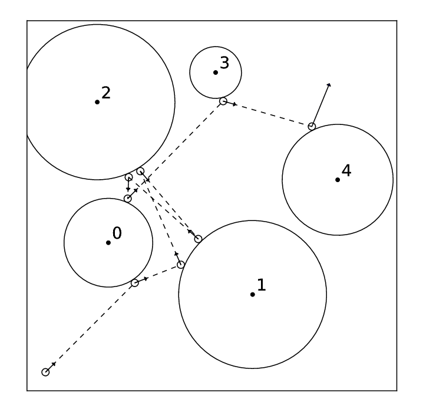

# 핀볼 시뮬레이션

문제 ID: `PINBALL`

## 문제

#### 문제

동혁이는 새로 나온 핀볼 게임을 하고 있습니다. 이 핀볼 게임은 아주 큰 게임판에 여러 개의 장애물을 놓고, 밖에서 공을 던져 가장 많은 장애물을 맞추는 것을 목표로 합니다. 공과 장애물은 완전한 원형이며, 공은 장애물에 부딪히면 항상 입사각과 반사각이 같도록 정반사됩니다. 장애물은 게임판에 고정되어 있기 때문에 움직이지 않습니다. 위 그림은 예제 게임판에서 동혁이가 던진 공이 장애물들에 순서대로 부딪히는 과정을 보여줍니다.

장애물들의 위치와 크기가 주어지고, 공의 위치와 방향이 주어질 때 공이 부딪히는 장애물들의 번호를 계산하는 프로그램을 작성하세요. 공은 반지름 1인 원이며, 항상 직선으로 움직인다고 가정합니다.

## 입력

#### 입력

입력의 첫 줄에는 테스트 케이스의 수 C(C <= 50)가 주어집니다. 각 테스트 케이스의 첫 줄에는 5개의 정수 x, y, dx, dy, N 이 주어집니다. 이 때 x, y (0 <= x, y <= 100)는 현재 공 중심의 위치를 나타내며, dx, dy (-10 <= dx, dy <= 10)는 공의 방향을 나타냅니다. 이 때 공은 현재 (x,y) 에서 (x+dx, y+dy)를 향해 일직선으로 굴러가고 있습니다. N(0 <= N <= 50)은 장애물의 개수를 나타내며, 각 장애물에는 0번부터 N-1번까지의 번호가 매겨져 있습니다. 그 다음 N줄에는 0번부터 각 장애물의 정보가 3개의 정수 x\_i, y\_i, r\_i 로 주어집니다. (0 <= x\_i, y\_i, r\_i <= 100) 이 때 i번 장애물은 (x\_i, y\_i)을 중심으로 한 반지름 r\_i인 원 형태를 하고 있습니다.

장애물은 게임판 밖에 걸쳐 있을 수도 있습니다. 두 장애물 사이의 거리가 2 이하인 경우는 없습니다. 시작 위치에서 공은 장애물과 겹쳐 있거나 닿아 있지 않습니다.

공은 게임판의 벽에 닿는 순간 게임판에서 떨어진다고 가정합니다. 입력에 공이 게임판의 벽과 장애물에 동시에 닿는 경우는 주어지지 않습니다.

## 출력

#### 출력

각 테스트 케이스마다 한 줄에 공이 닿는 순서대로 각 장애물의 번호를 출력합니다. 만약 공이 장애물에 100번 넘게 부딪힐 경우 첫 100번 부딪히는 장애물의 번호만을 출력합니다.

주어진 입력에서 장애물의 크기나 위치가 10^-7 만큼 변하더라도 답은 변하지 않는다고 가정해도 좋습니다.

## 노트

#### 노트
