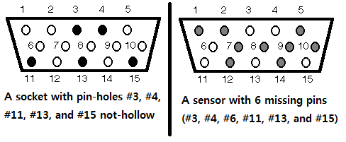

# Plug-in

문제 ID: `PLUGIN`

## 문제

#### 문제

Consider a socket having X rows of pin-holes, and a sensor having X rows of pins. Some pin-holes on the socket may not be hollow, which do not allow a pin to be plugged in (because a pin can only be plugged into a hollow pin-hole). Similarly, some pins on the sensor might be missing. A sensor can be connected to a socket if all pins could be plugged into corresponding pin-holes.

For example, a socket with 5 pin-holes being not hollow and a sensor with 6 missing pins are in the figure.  
This sensor could be connected to the socket because for all 9 pins it has, the socket has corresponding hollow pin-holes (here, the correspondence is remarked by numbers from 1 to 15). Note that the pin #6 is missing in the sensor while the pin-hole #6 is hollow, but it can still be connected.

Given 3 sockets and 3 sensors, write a program to determine whether the three sensors can be connected to the three sockets. Each sensors could be connected to any socket, but all three sensors must be connected to distinct sockets simultaneously.

## 입력

#### 입력

Your program is to read from standard input. The input consists of T test cases. The number of test cases T is given in the first line of the input. The first line of each test case contains two integers X and Y (3 <= X, Y <=  10), where Y is the number of pin-holes and pins in each row.

The next 3X lines describe the three sensors in binary representation, such that the first X lines for the first sensor, the following X lines for the second sensor, and the last X lines for the third sensor. Each row will contain a binary string of length Y where 0 indicates that the pin is missing and 1 indicates that there is a pin.

The next 3X lines describe the three sockets in the same manner. For sockets, 0 indicates that the hole is not hollow and 1 indicates that it is hollow.

## 출력

#### 출력

Your program is to write to standard output. Print exactly one line for each test case. For each test case, print ‘YES’(quotations for clarification only) if it is possible to connect all three sensors. Otherwise, print ‘NO’.

## 노트

#### 노트
