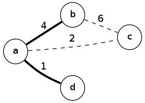

# 선거 공약

문제 ID: `PROMISES`

## 문제

#### 문제

경제가 침체기에 빠졌을 때 정치인들이 흔히 내거는 공약으로 대규모 토목 공사를 통한 경기 부양책이 있습니다. 이번에 집권당에서는 향후 N 년간 1년에 하나씩 전국의 주요 도시들을 잇는 대형 고속도로를 건설하겠다는 공약을 내걸었습니다. 재야 경제 연구가인 의권이는 이들의 공약을 훑어보다가 이들이 아무 생각 없이 공약을 내걸었다는 결정적인 증거를 발견했습니다. 이들 중 일부 고속도로는 건설하는 의미가 거의 없다는 것입니다.

어떤 고속도로를 새로 건설할 당위성이 있기 위해서는 기존에 고속도로를 통해 오갈 수 없던 두 도시가 새로 연결되거나, 두 도시를 오가는 데 걸리는 시간이 단축되어야 합니다. 의권이는 공약 중 일부 고속도로는 이 두 조건중 아무 것도 만족하지 못한다는 사실을 알아냈습니다.

위 그림과 같이 4개의 도시 a, b, c, d가 있는데, 이 중 a와 b, a와 d는 굵은 실선으로 표시된 고속도로들로 연결되어 있다고 합시다. 각 선에 표시된 숫자는 두 도시를 오가는 데 걸리는 시간을 나타냅니다. 이 때 a와 c사이에 새 고속도로를 건설한다고 합시다. c는 다른 도시와 고속도로를 통해서 왕복할 방법이 없었으므로, 이 고속도로는 의미가 있습니다. 그런데 그 다음 해에 b와 c를 잇는 고속도로를 건설한다고 합시다. 이 고속도로가 없더라도 a를 경유하면 b와 c 사이를 6시간만에 움직일 수 있으므로, 편도 6시간이 걸리는 이 고속도로는 아무런 의미가 없습니다.

기존에 존재하는 고속도로들의 정보와 앞으로 N 년간 건설하기로 예정된 고속도로들의 정보가 주어질 때, 새로 건설하기로 한 고속도로들 중 몇 개가 건설할 의미가 없는지 계산하는 프로그램을 작성하세요.

## 입력

#### 입력

입력의 첫 줄에는 테스트 케이스의 수 C (1 <= C <= 50) 이 주어집니다. 각 테스트 케이스의 첫 줄에는 도시의 수 V (2 <= V <= 200) 와 현재 존재하는 고속도로의 수 M, 그리고 앞으로 건설될 고속도로의 수 N 이 주어집니다. (0 <= M+N <= 1000) 그 후 M 줄에는 각 줄에 3개의 정수 a, b, c (0 <= a,b <= V-1,1 <= c <= 100000) 로 이미 존재하는 고속도로의 정보가 주어집니다. a 와 b 는 이 고속도로가 연결하는 도시의 번호, 그리고 c 는 해당 고속도로를 통해 두 도시 간을 이동하는 데 걸리는 시간을 나타냅니다. 그 후 N 줄에 같은 형태로 앞으로 건설할 고속도로의 정보가 순서대로 주어집니다.

모든 도로는 양방향 통행이 가능하며, 각 경우의 통행 시간은 같습니다.

## 출력

#### 출력

각 테스트 케이스마다 한 줄에 N 개의 고속도로를 순서대로 건설했을 때 건설할 의미가 없는 고속도로의 수를 출력합니다.

## 노트

#### 노트
