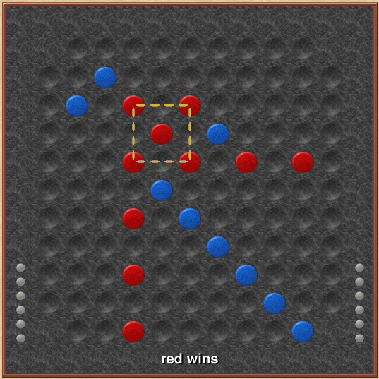
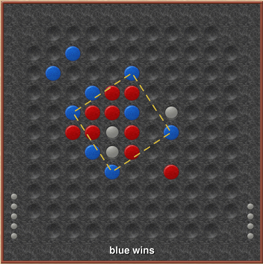

# Quod

문제 ID: `QUOD`

## 문제

#### 문제

Quod 는 컴퓨터 과학자인 G. Keith Still 이 만든 보드게임입니다. 이 게임은 11x11 의 격자 모양 게임판을 이용해 진행하며, 이 격자 판의 네 모퉁이를 제외한 117개의 칸을 이용합니다. 게임을 하는 두 사람은 파랑색과 빨강색 말 중 하나를 택해, 각자 자신의 색의 조각 20개 (Quods) 와 방어용 조각 6개  
(Quasars) 를 가지고 번갈아 가면서 플레이합니다.

자신의 턴에 할 수 있는 일은 다음과 같습니다.

1. 먼저 자신이 가진 Quaser 를 마음대로 놓습니다. 한 턴에 놓을 수 있는 Quaser 의 개수 제한은 없으며, Quaser 를 사용하지 않는 것도 가능합니다.
2. Quaser 를 다 놓으면 자신의 Quod 를 하나 놓습니다.

위와 같이 번갈아 가면서 플레이하다가, 자신의 Quod 를 네 꼭지점으로 갖는 정사각형을 먼저 만드는 쪽이 승리합니다. 만들어지는 정사각형의 종류에는 제한이 없으며, Quaser 는 상대가 정사각형을 만들지 못하도록 방어하는 용도로만 사용됩니다. 아래 그림은 Quod 게임의 예입니다.

이것까지는 간단한 것 같지만, 이 게임에서 막상 어려운 것은 실제로 정사각형이 만들어졌는지를 판단하는 것입니다. Quod 게임에서 만들어질 수 있는 정사각형의 개수는 1173개나 되기 때문에, 이미 정사각형이 만들었는데도 만든 줄 모르고 계속 플레이하는 경우가 잦습니다. (위 그림과 같이 찾기 쉬운 정사각형이 만들어졌다면 다행입니다만) 이 문제를 해결하기 위해 당신은 진행 중인 Quod 게임의 게임판을 입력받아서 정사각형이 완성되었는지 여부를 판단해 주는 프로그램을 만들기로 했습니다.

마지막 테스트 케이스에서 만들어지는 정사각형은 다음과 같습니다.  

## 입력

#### 입력

입력의 첫 줄에는 테스트 케이스의 개수 T (1 <= T <= 10000) 가 주어집니다.  
각각의 테스트 케이스는 11줄에 각각 11개의 문자로 구성되어 있으며, Quod 게임이 진행중인 11x11의 격자의 상태를 나타냅니다. 'X'는 조각을 놓을 수 없는 격자판 의 네 귀퉁이이며, '.'은 빈칸, 'B'는 파랑색, 'R'은 빨강색, 'W'는 Quaser를 나타냅니다. 정사각형이 두 개 이상 생기는 경우는 없습니다.

## 출력

#### 출력

각 테스트 케이스마다 한 줄을 출력하되, 정사각형이 만들어진 경우 정사각형을 만든 조각의 색 ('Blue' 혹은 'Red') 을 출력하고, 정사각형이 없는 경우 'No squares' 를 출력합니다. 따옴표는 출력하지 않습니다.

## 노트

#### 노트
