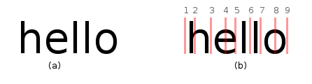

# reCAPTCHA

문제 ID: `RECAPTCHA`

## 문제

#### 문제

위의 알고스팟 회원 가입 양식에 보이는 Security Check 는 스팸 봇과 사용자를 구별하기 위한 도구로, **reCAPTCHA** 라고 부른다.  
이미지에 쓰여 있는 글씨를 읽어내는 작업은 기계가 하기 어렵기 때문에 사람이 직접 해야 하고, 따라서 프로그램을 돌려 자동으로 회원 가입하는 것을 방지하는 좋은 수단이 된다.  
그런데 지난 8월에 열린 해킹 컨퍼런스 데프콘 18 에서 이 **reCAPTCHA** 를 높은 확률로 해결할 수 있는 기술이 발표되었다. 이 문제에서는 이 알고리즘의 마지막 부분만을 풀어 본다.  
  
  
  
이 알고리즘은 크게 전처리, 경계 추출, 유사도 판정, 단어 판별의 네 단계로 나뉜다.

* 전처리 - 전처리 과정에서는 변형되어 있는 글자들을 원래의 형태로 변형한다. 위 그림의 (a) 는 전처리가 끝난 이미지를 보여준다.
* 경계 추출 - 경계 추출 과정에서는 글자의 경계 같아 보이는 부분들을 휴리스틱 알고리즘으로 추출한다. 그림 (b) 의 붉은 선들이 그 예이다. 9개의 경계 후보를 추출했다고 하고, 이들을 1 부터 9 까지의 번호로 부르자.
* 유사도 판정 - 경계 후보들 사이의 각 구간이 어떤 글자와 닮았는지를 판단한다. 유사도 함수 sim(s,e,C)는, s - e 구간이 알파벳 C와 얼마나 닮았는지를 표현한다. 예로 그림 (b) 를 보면 sim(1,3,h) 는 sim(1,3,y) 보다 훨씬 높은 값을 가질 거라는 것을 알 수 있다.
* 단어 판정 - 두 번째 과정에서 골라낸 경계 후보 중 어떤 선을 택해야 할지를 결정한다. (b) 에서, 2-3 구간이 어떤 글자와도 닮지 않았다는 것을 고려하면, 2번 후보를 무시하고 1-3 구간을 h로 해석해야 한다는 것을 알 수 있다.

  
  
전처리, 경계 추출, 유사도 판정이 완료된 데이터가 주어질 때, 마지막 단어 판정 과정을 구현하는 프로그램을 작성하라. 단어 판정 과정에서는 경계 후보 중 어떤 것을 선택하고 나눠진 각 구간을 어떤 글자로 보아야 할 지를 결정하는데, 가능한 모든 경우 중 각 구간별 유사도의 곱이 가장 큰 경우를 선택한다. 예를 들어, 그림 (b) 에서 가장 유사도의 곱이 큰 경우는  
  
sim(1,3,h) \* sim(3,5,e) \* sim(5,6,l) \* sim(6,7,l) \* sim(7,9,o)

가 된다.

* 입력으로 주어지는 **CAPTCHA** 에는 항상 알파벳 소문자만 출현한다.
* "w| |o|r|d" 에서처럼 어떤 글자도 없이 비어 있는 구간은 없다고 가정한다.

## 입력

#### 입력

입력의 첫 줄에는 테스트 케이스의 개수 T 가 주어진다. 그 후, T 개의 테스트 케이스가 순서대로 주어진다.

각 테스트 케이스의 처음에는 추출한 경계의 수 N (2 <= N <= 50) 가 주어진다. 이후, N\*(N-1)/2개의 줄에 각 구간의 유사도가 주어진다. 구간은 왼쪽 경계가 앞에 있는 구간, 왼쪽 경계가 같은 경우 오른쪽 경계가 앞에 있는 구간이 먼저 오는 순서로 주어지며, 각 줄에는 해당 구간의 각 글자에 대한 유사도가 a부터 z까지 26개의 실수로 주어진다. 모든 유사도는 0부터 1 사이의 값을 갖는다.

## 출력

#### 출력

각 테스트 케이스에 대해 한 줄에 하나씩 가장 유사도가 높은 단어를 출력한다.

최대 유사도를 갖는 단어는 유일하다. 엄밀히 말해, 최대 유사도를 x라 할 때 0.999999 x 이상의 유사도를 갖는 다른 단어는 존재하지 않는다고 가정해도 무방하다.

Hint: 첫 번째 예제에서, 유사도 값을 포함하는 세 개의 줄은 순서대로 1 - 2 구간, 1 - 3 구간, 2 - 3 구간의 알파벳 별 유사도를 나타낸다.

## 노트

#### 노트
