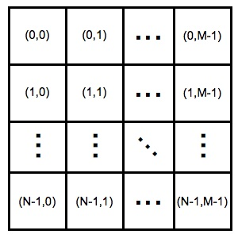
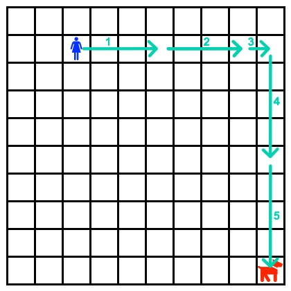

# 슈퍼판타 지워

문제 ID: `SFW`

## 문제

#### 문제

원하의 팀이 관리하는 모바일 게임 중 하나인 '슈퍼판타 지워'는 플레이어가 슈퍼 주인 아주머니가 되어 슈퍼를 노리는 진상 고객으로부터 슈퍼를 지키는 턴제 RPG 경영 게임이다. 모바일 RPG 게임 시장에서 자동 전투 모드가 없는 게임은 경쟁력이 떨어지므로, '슈퍼판타 지워'도 이번 대규모 업데이트에 자동 전투를 추가하려고 한다.

'슈퍼판타 지워'의 전투 화면은 내부적으로 아래와 같이 $(0, 0)$부터 $(N-1, M-1)$의 정수 칸으로 되어 있다.

처음 슈퍼 아주머니는 $(r0, c0)$에서 시작하여, 한 턴 당 세로로 최대 $A$칸을 이동하거나, 가로로 최대 $B$칸을 이동할 수 있다. 진상 손님의 위치가 $(r, c)$라면, 슈퍼 아주머니가 $(r, c)$에 도달하면 진상 손님을 쫓아낼 수 있다. 이 때, 진상 손님은 턴이 지나도 움직이지 않는다.

자동 전투 AI를 만들기 위해 슈퍼 주인 아주머니 캐릭터가 최소 몇 턴이 지나야 진상 손님을 쫓아낼 수 있는지 계산해야 한다.

예를 들어, $A = 4$, $B = 3$이고, 슈퍼 아주머니의 처음 위치가 $(1, 2)$, 진상 손님이 $(9, 9)$에 있다고 하면 아래와 같이 이동하여 5턴만에 진상 손님을 쫓아낼 수 있다.

## 입력

#### 입력

입력은 여러개의 테스트케이스로 이뤄지며, 첫 줄에 테스트 케이스의 수 $T$ ($1 \le T \le 1\,000$)가 정수로 주어진다.

테스트 케이스마다 정수 $N$, $M$ ($1 \le N, M \le 2\,000\,000\,000$), $r0$, $c0$, $r$, $c$ ($0 \le r0, r < N$, $0 \le c0, c < M$), $A$, $B$ ($1 \le A < 2\,000\,000\,000$, $1 \le B < 2\,000\,000\,000$)가 각각 공백 하나로 구분되어 한 줄에 주어진다.

## 출력

#### 출력

각 테스트 케이스마다 첫 번째 줄에 정답을 출력한다.

## 노트

#### 노트
