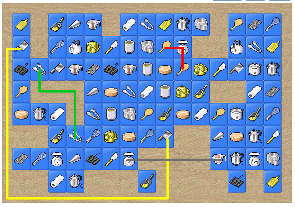

# Shisen-sho

문제 ID: `SHISENSHO`

## 문제

#### 문제

Shisen-sho(in Korean, Sa-Cheon-Sung *사천성*) is a board game that originated in Japan, which is popular in Korea as well. The game is played on a rectangular game board with $N \times M$ cells, and various tiles are placed on some of the cells. The object of the game is to remove all of the tiles from the board, and the only way to remove tiles from the board is to remove one pair of matching tiles connected by a *valid path*. Throughout the game play, the player continues to remove pairs of tiles from the board, pair by pair.

A *valid path* is a path on the game board which satisfies the following:

* The path connects two matching tiles.
* The path consists of at most three axis-aligned line segments, starting and ending at the center of two tiles.
* The path should not touch or pass through any cells containing tiles, except the starting and ending tiles.

For example, the above figure shows a possible game board and some valid and invalid paths.

* The green path is a valid one.
* The gray path is invalid, because it connects two different tiles.
* The yellow path is invalid, because it contains 4 line segments.
* The red path is invalid, because it passes through a cell that is not empty.

We want to assign difficulty levels to a set of Shisen-sho game boards.  
The difficulty level is defined by the number of distinct pairs of tiles that can be removed from the board with a single move. A single move means removing a pair of tiles connected by a valid path.  
Given a game board, Write a program to compute the difficulty level of the board.

## 입력

#### 입력

Your program is to read from standard input. The input consists of $T$ test cases.  
The number of test cases $T$ is given in the first line of the input.  
The first line of each test case contains two integers $H$ and $W\;(3 \le H, W \le 50)$.  
$H$ lines will follow, each of which contains $W$ characters where each character denotes a cell in the game board.  
A period(`.`) denotes an empty cell, and lower and upper alphabet characters denote different kind of tiles.  
For all test cases, the first row, first column, last row, and last column of the game board will be empty.

## 출력

#### 출력

Your program is to write to standard output. Print exactly one line for each test case.  
The line should contain an integer indicating the number of distinct pair of tiles that can be removed from the board with a single move.

## 노트

#### 노트
