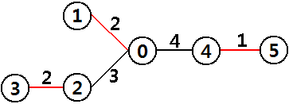

# Snow-Plow Car

문제 ID: `SNOWPLOW`

## 문제

#### 문제

**Seoul National University(SNU)**, colloquially known in Korean as **Seoul-dae**, is a national research university in Seoul, Korea.  
Originally, the main campus, which embraced the College of Humanities and Sciences and College of Law, was located on **Daehangno(University Street)** in **Jongno**.  
Most parts of the university were relocated to a new campus in **Gwanak** in the period between 1975 and 1979, where Gwanak campus is located on the northwest slope of **Gwanaksan**, a small mountain in Seoul.

Last winter, it snowed often in Korea, and particularly, it snowed heavily in **Gwanak-gu**, a district of Seoul where SNU and Gwanaksan are located.  
When it snows heavily, cars and buses cannot move along the roads which are on the slope of Gwanaksan.  
Lots of building are located all around the campus, and the buildings are connected with a bidirectional roads.  
Since there is exactly one simple path(a path without any duplicate road) from one building to another, professors and students claim for their inconvenience every snowy winter.

The administration center of SNU has bought snow-plow cars(a vehicle intended for removing snow from the road) and placed them on every road.  
However, as it snowed heavily last winter, all snow-plow cars are now broken.  
The administration center decided to fix snow-plow cars, but due to limited budget, they cannot fix every single snow-plow car.  
Therefore, they decided to pick some of the snow-plow cars to be fixed, in order to make it easy to remove snow from the roads on the mountain slope (note that each road may or may not be on the mountain slope).   
For each slope road, the snow on the road can be removed if the snow-plow car on the road itself is fixed or that on any of its adjacent road is fixed. Two roads are said to be adjacent if they are connected to the same building.

For example, on the above figure, there are six building numbered from 0 to 5, and there are 3 roads in red (namely, 0-1, 2-3, and 4-5) that are on the mountain slope. The number on the road is the cost to fix the snow-plow car on that road. If all snow-plow cars on slope roads are fixed, it costs 5(=2+2+1).  
On the other hand, if snow-plow cars on road 0-4 and 2-3 are fixed, it costs 6=(4+2). snow-plow car on road 0-4 covers two slope roads, 0-1 and 4-5. The optimal way is to fix the snow-plow cars on road 0-2, 4-5, which costs 4(=3+1). In this case, the snow-plow car on road 0-2 covers road 0-1 and 2-3.

Given a tree representing the buildings and roads of SNU, write a program to compute the minimum cost to fix snow-plow cars in order to satisfy the requirements.

## 입력

#### 입력

Your program is to read from standard input. The input consists of T test cases.  
The number of test cases T is given in the first line of the input.  
The first line of each test case contains an integer, n (1 <= n <= 10,000), the number of buildings in SNU.  
Each line of the next n-1 lines contains four integers, x, y, z, and c, where there is road connecting building number x and y.  
Third integer z will be 1 if the road is on the mountain slope, and 0 if the road is **not** on the mountain slope.  
The cost for fixing a snow-plow car on this road is c(1 <= c <= 100,000)  
Building numbers will be distinct integers from 0 to n-1.

## 출력

#### 출력

Your program is to write to standard output. Print exactly one line for each test case.  
The line should contain the minimum cost to fix snow-plow cars.

## 노트

#### 노트
